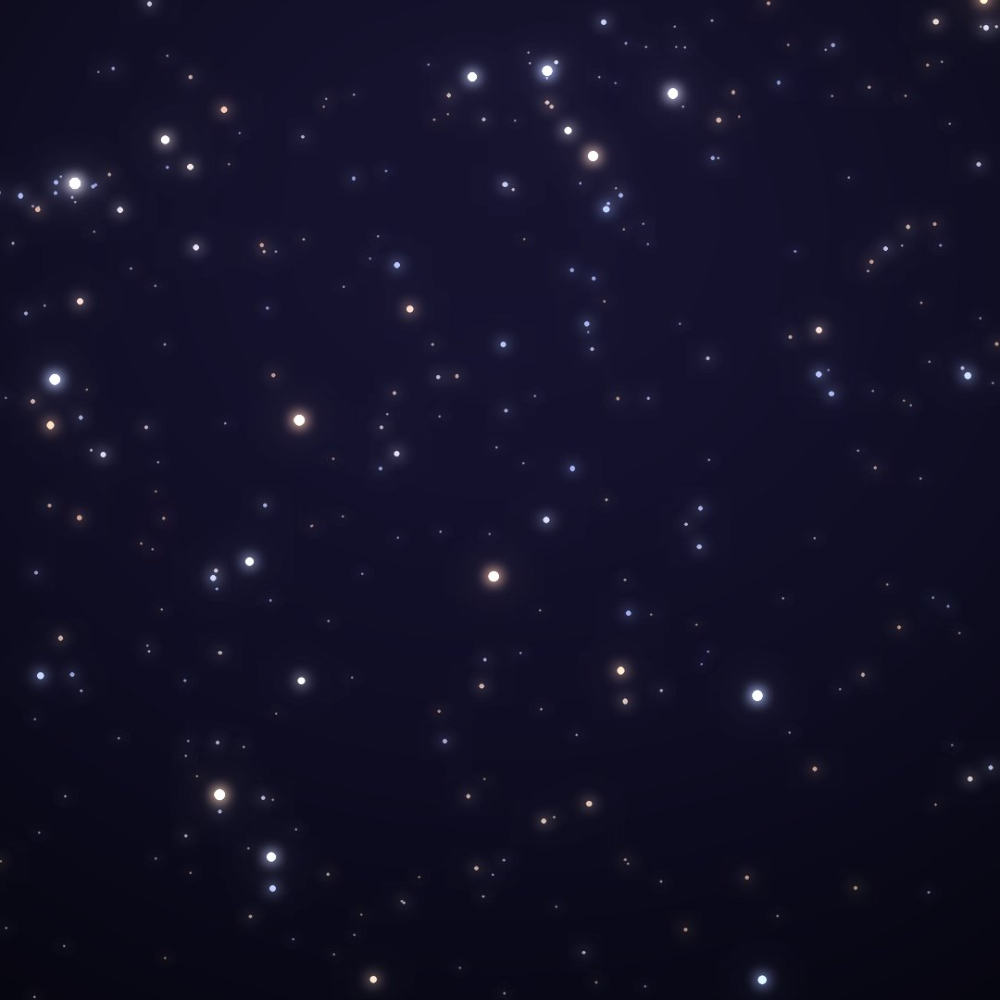
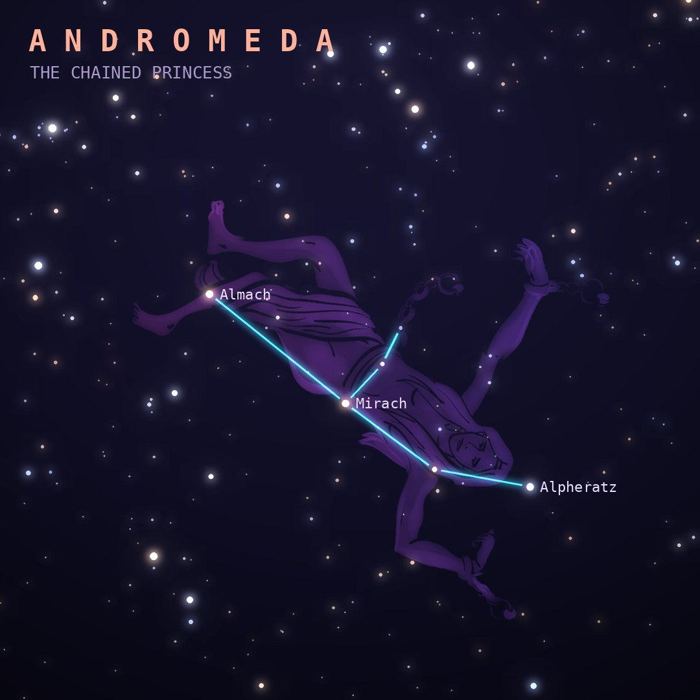

## Front

Which constellation is this?

## Back
# Andromeda
*The Chained Princess* · And · genitive *Andromedae*

Andromeda was the daughter of Cepheus and Cassiopeia, chained to a sea cliff as a sacrifice to the monster Cetus until Perseus rescued her. Her brightest star, Alpheratz, doubles as a corner of the Great Square of Pegasus.

- **Brightest star:** Alpheratz (α Andromedae), magnitude 2.1
- **Best seen:** November evenings
- **Fully visible:** between 90°N and 40°S

> **Fun fact:** The Andromeda Galaxy (M31), about 2.5 million light-years away, is the most distant thing most people can see with the naked eye, and it is on course to merge with the Milky Way in roughly 4 to 5 billion years.
