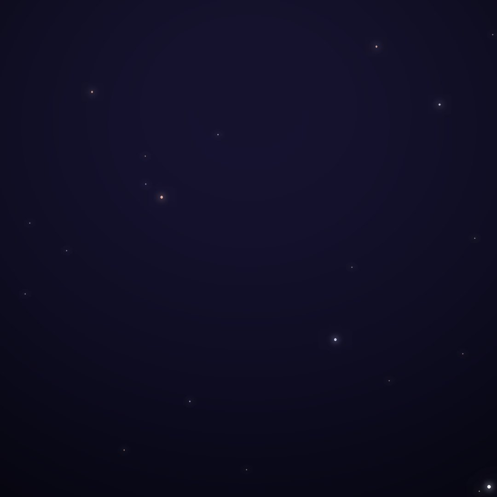
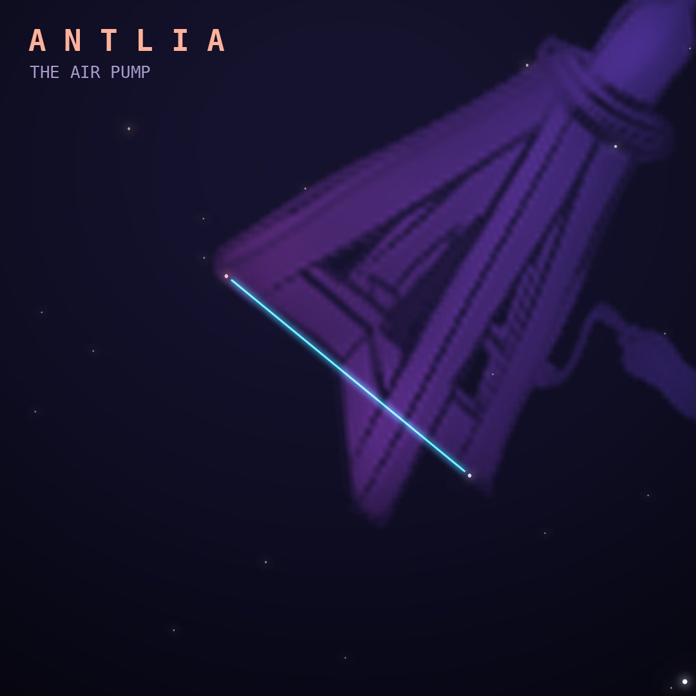

## Front

Which constellation is this?

## Back
# Antlia
*The Air Pump* · Ant · genitive *Antliae*

A faint southern constellation created by Nicolas-Louis de Lacaille in the 1750s, honoring the air pump, one of the great scientific instruments of the age. It sits between Hydra and Vela with no star brighter than magnitude 4.

- **Brightest star:** α Antliae, magnitude 4.3
- **Best seen:** April evenings
- **Fully visible:** between 55°N and 90°S

> **Fun fact:** Antlia is one of 14 constellations Lacaille invented while mapping the southern sky from South Africa; nearly all of them are named after scientific or artistic tools rather than myths.
