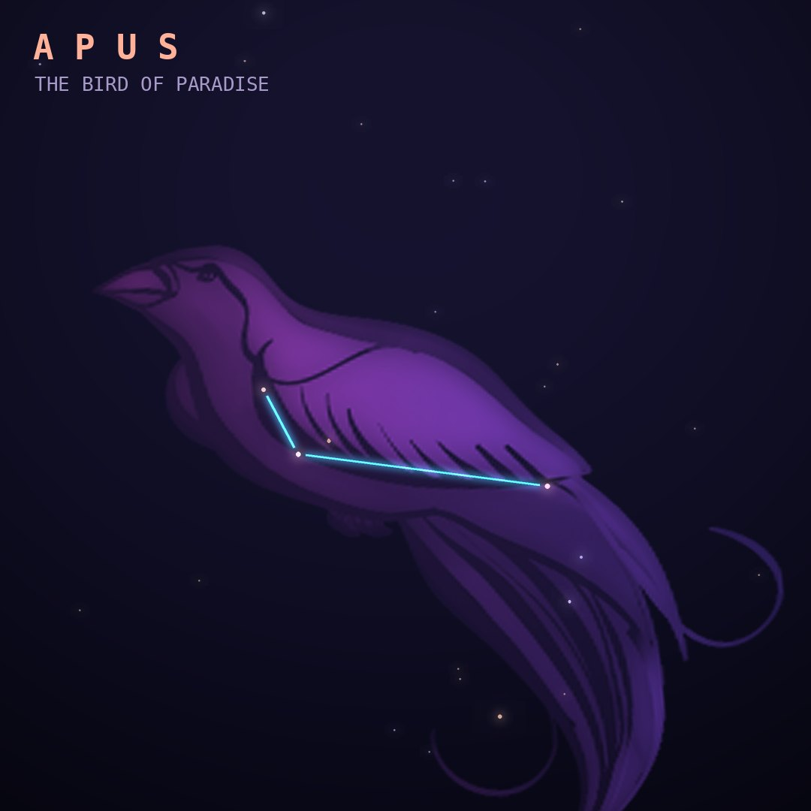

## Front

Which constellation is this?

## Back
# Apus
*The Bird of Paradise* · Aps · genitive *Apodis*

A small, faint constellation close to the south celestial pole, introduced from the observations of Dutch navigators Pieter Keyser and Frederick de Houtman in the 1590s.

- **Brightest star:** α Apodis, magnitude 3.8
- **Best seen:** July evenings
- **Fully visible:** between 10°N and 90°S

> **Fun fact:** Its name comes from the Greek apous, "footless": bird-of-paradise skins reached Europe with the feet removed, so people believed the birds had no feet and never landed.
