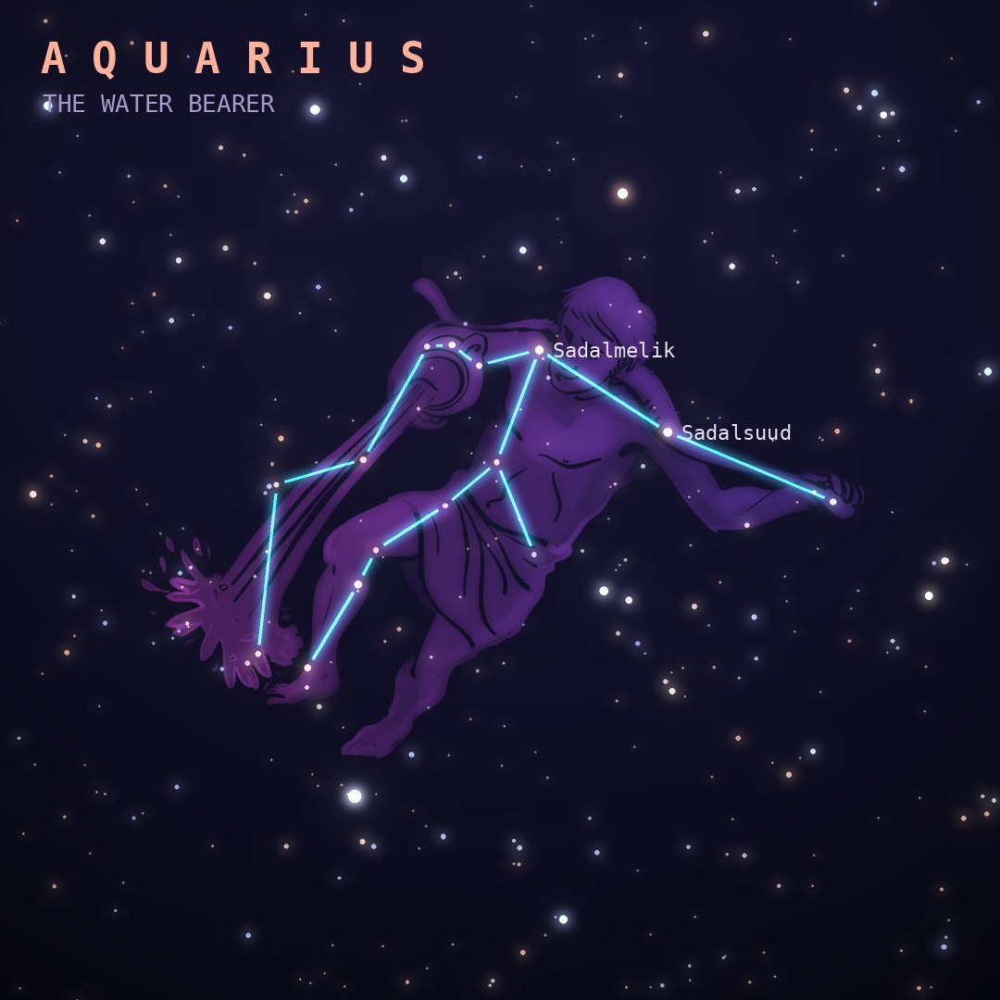

## Front

Which constellation is this?

## Back
# Aquarius
*The Water Bearer* · Aqr · genitive *Aquarii*

A zodiac constellation showing a youth, often identified as Ganymede, pouring water from a jar. It lies in a watery region of sky called "the Sea" alongside Cetus, Pisces, Eridanus and Piscis Austrinus.

- **Brightest star:** Sadalsuud (β Aquarii), magnitude 2.9
- **Best seen:** October evenings
- **Fully visible:** between 65°N and 90°S

> **Fun fact:** Aquarius holds the Helix Nebula, one of the closest planetary nebulae to Earth, nicknamed the "Eye of God", and the Eta Aquariid meteor shower, made of debris from Halley's Comet.
