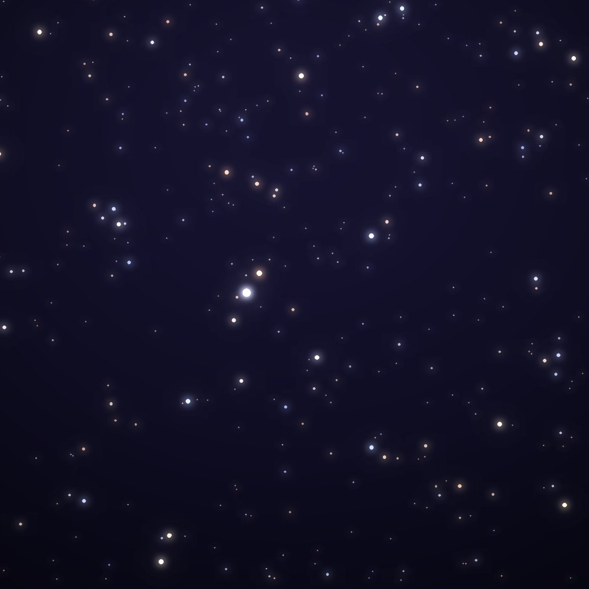
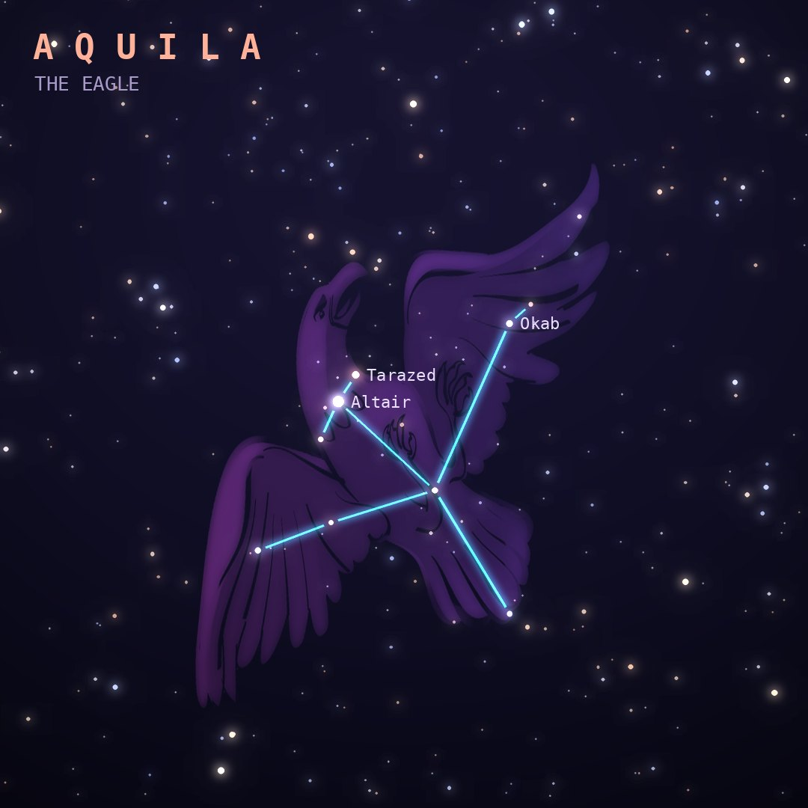

## Front

Which constellation is this?

## Back
# Aquila
*The Eagle* · Aql · genitive *Aquilae*

The eagle that carried Zeus's thunderbolts. Its brightest star, Altair, forms one corner of the Summer Triangle with Vega and Deneb.

- **Brightest star:** Altair (α Aquilae), magnitude 0.8
- **Best seen:** August evenings
- **Fully visible:** between 80°N and 75°S

> **Fun fact:** Altair spins once every 9 hours or so, so fast that it bulges at the equator, where it is about 20% wider than it is pole to pole.
