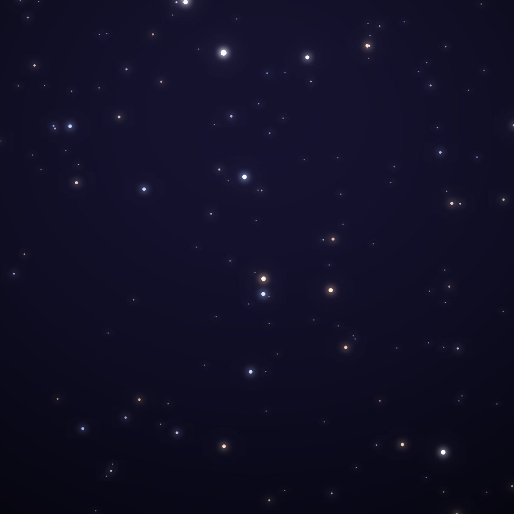
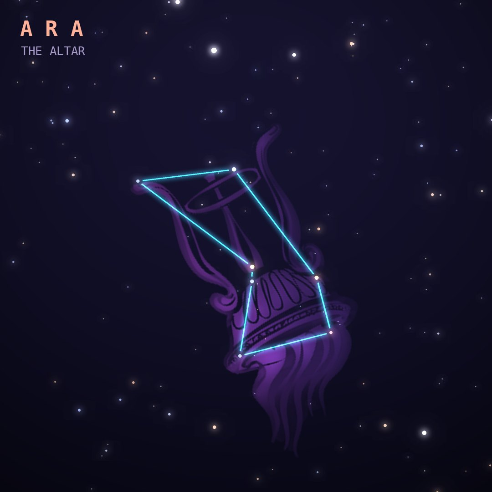

## Front

Which constellation is this?

## Back
# Ara
*The Altar* · Ara · genitive *Arae*

The altar on which the Olympian gods swore allegiance before their war against the Titans. In some tellings, the Milky Way above it is the altar's rising smoke.

- **Brightest star:** β Arae, magnitude 2.8
- **Best seen:** July evenings
- **Fully visible:** between 30°N and 90°S

> **Fun fact:** Ara contains NGC 6397, one of the two closest globular clusters to Earth, a ball of ancient stars about 7,800 light-years away.
