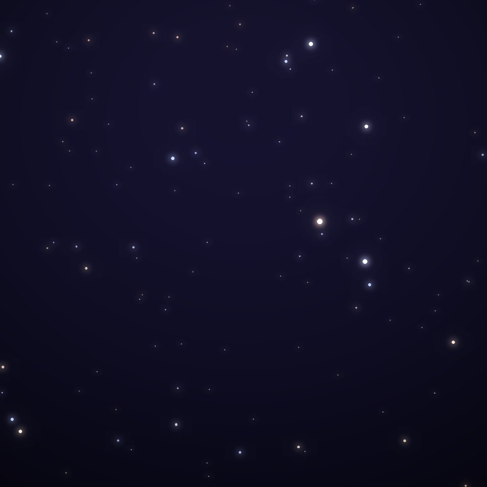
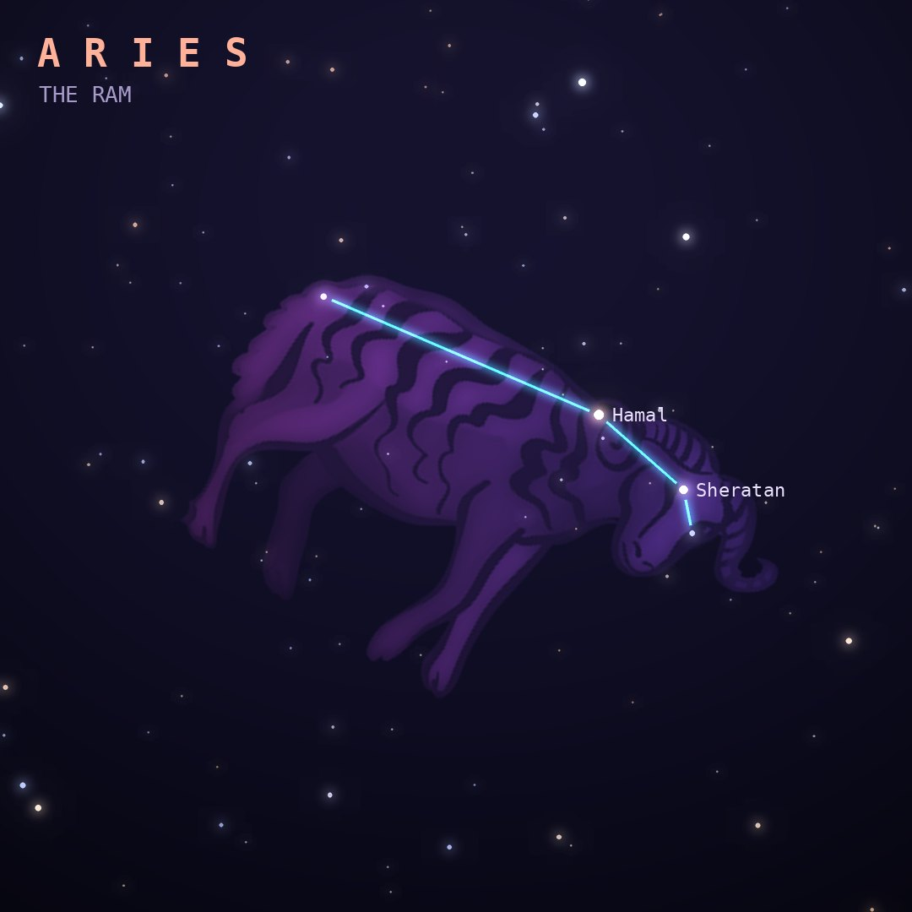

## Front

Which constellation is this?

## Back
# Aries
*The Ram* · Ari · genitive *Arietis*

A zodiac constellation representing the ram with the golden fleece that rescued Phrixus; Jason and the Argonauts later sailed to recover the fleece.

- **Brightest star:** Hamal (α Arietis), magnitude 2.0
- **Best seen:** December evenings
- **Fully visible:** between 90°N and 60°S

> **Fun fact:** About 2,000 years ago the Sun stood in Aries at the March equinox, so that point is still called the "First Point of Aries", even though Earth's wobble has since carried it into Pisces.
