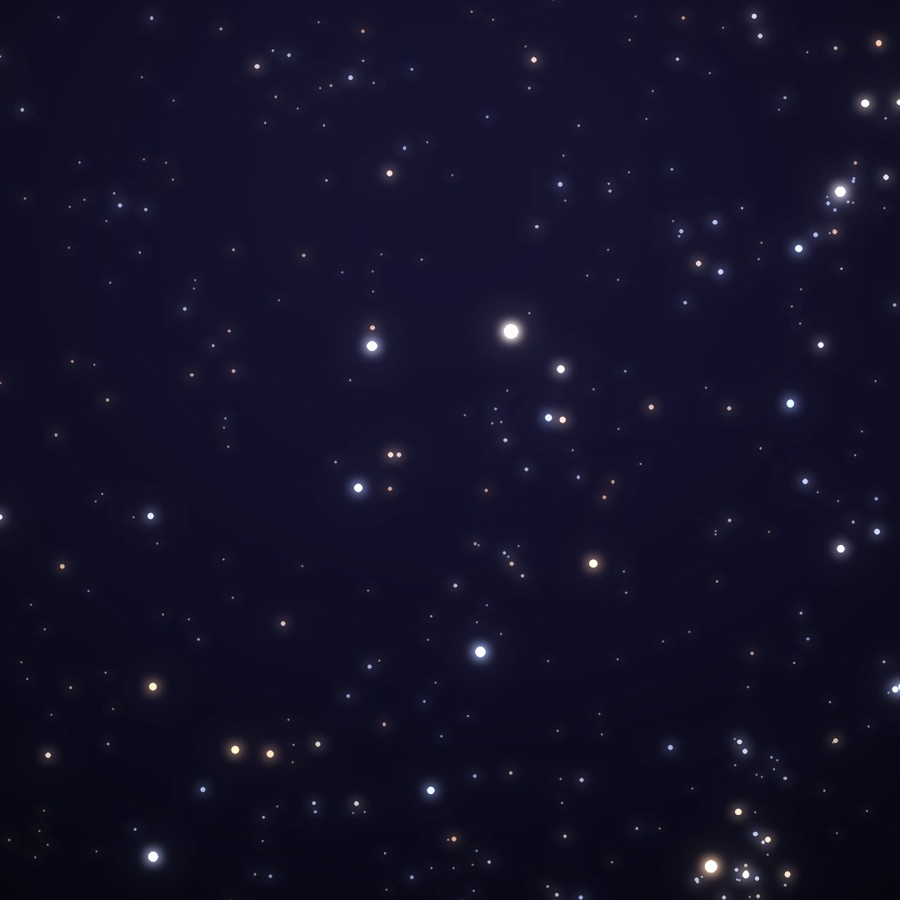
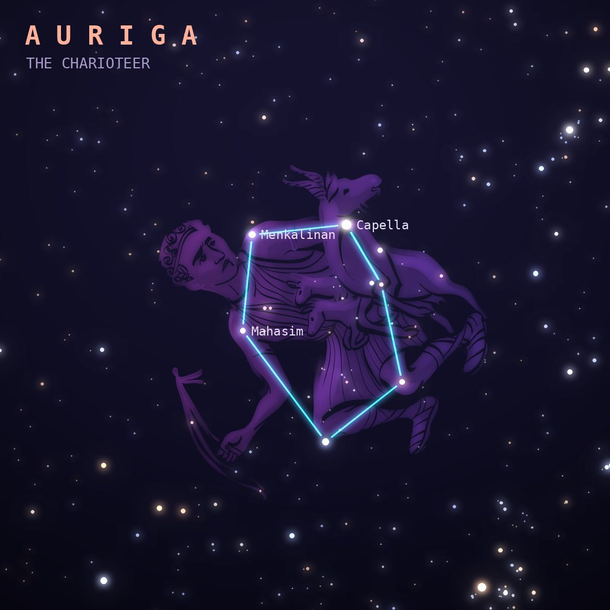

## Front

Which constellation is this?

## Back
# Auriga
*The Charioteer* · Aur · genitive *Aurigae*

A charioteer, often identified with Erichthonius, inventor of the four-horse chariot, drawn carrying a she-goat and her kids. Its bright stars form a large pentagon high in winter skies.

- **Brightest star:** Capella (α Aurigae), magnitude 0.1
- **Best seen:** January evenings
- **Fully visible:** between 90°N and 35°S

> **Fun fact:** Capella, "the little she-goat", looks like one star but is two yellow giants orbiting each other every 104 days, with a pair of faint red dwarfs far off.
