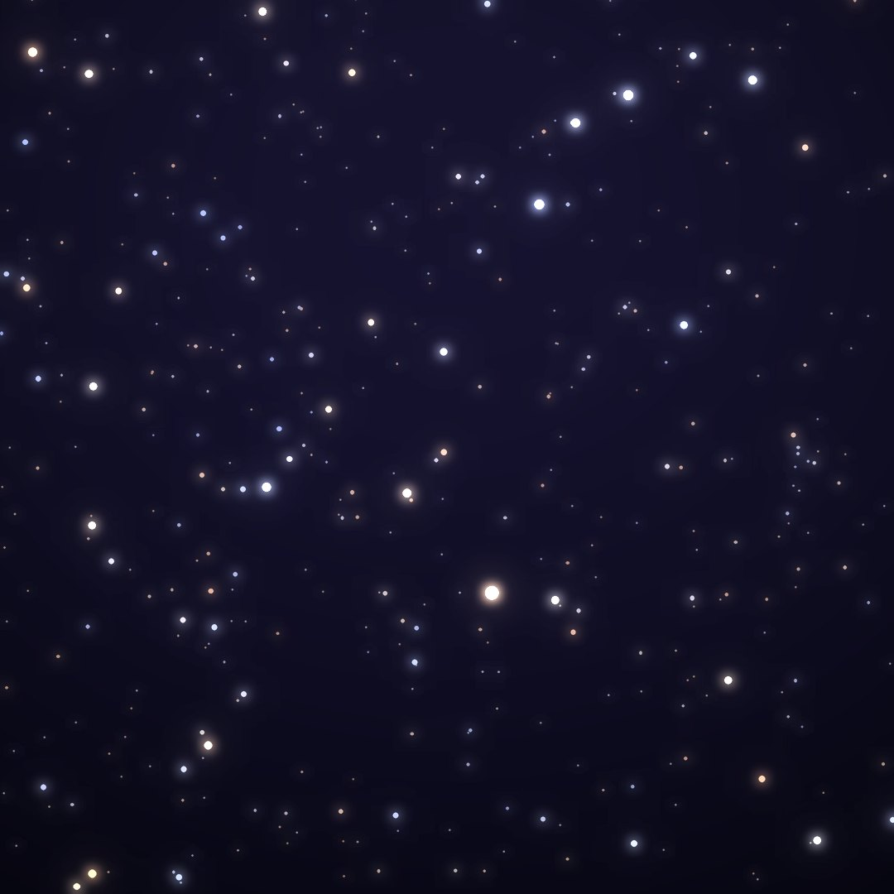
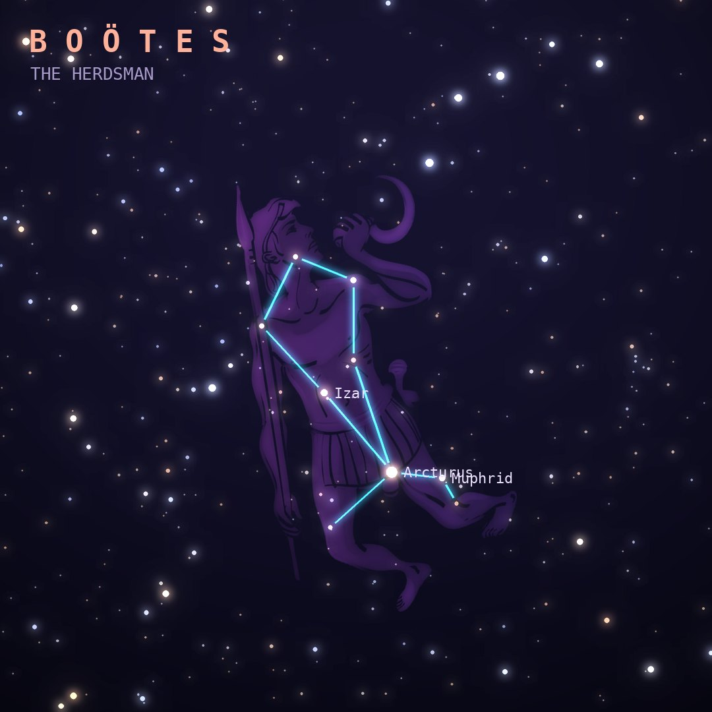

## Front

Which constellation is this?

## Back
# Boötes
*The Herdsman* · Boo · genitive *Boötis*

A herdsman driving the bears of Ursa Major around the pole. Find it by following the curve of the Big Dipper's handle: "arc to Arcturus".

- **Brightest star:** Arcturus (α Boötis), magnitude −0.1
- **Best seen:** June evenings
- **Fully visible:** between 90°N and 40°S

> **Fun fact:** In 1933 starlight from Arcturus, caught by a telescope and photocell, switched on the lights of the Chicago World's Fair. The light was thought to have left the star around the time of Chicago's previous fair in 1893.
