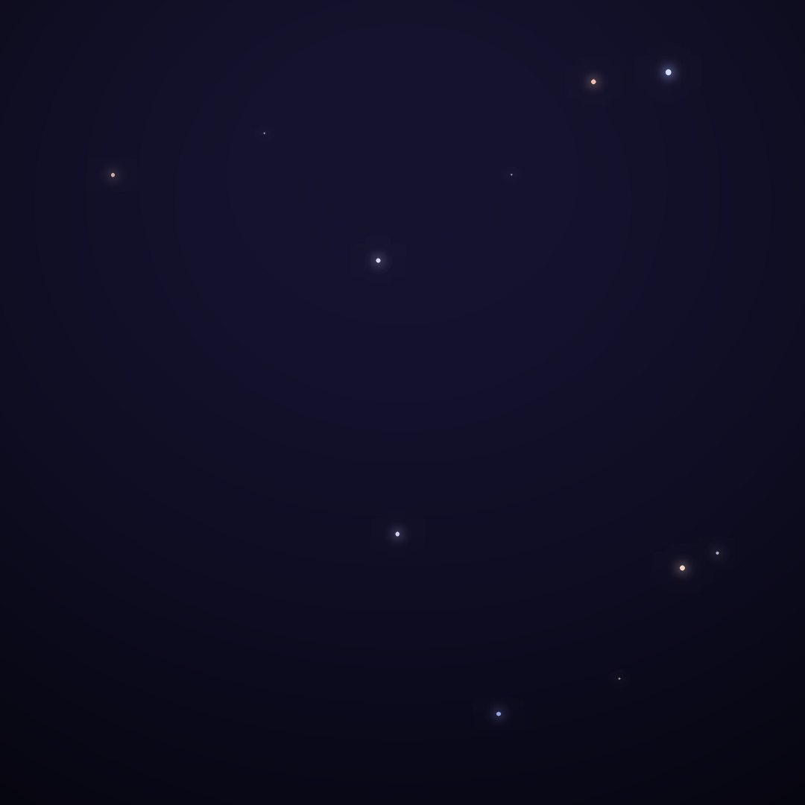
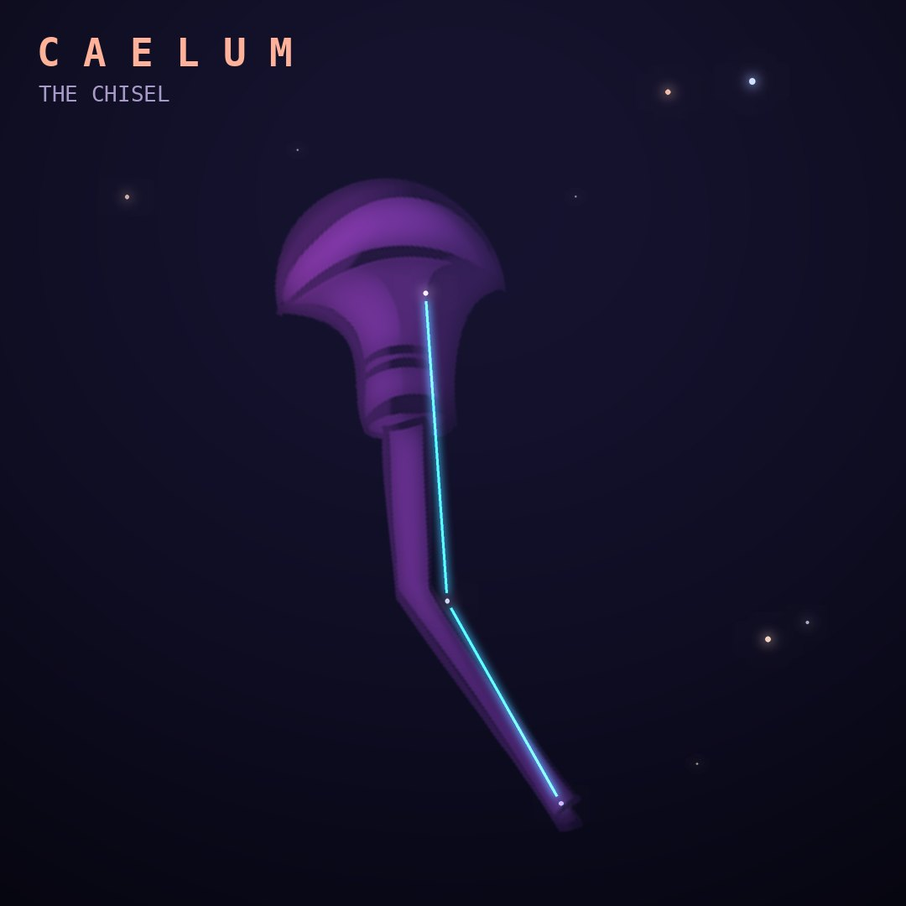

## Front

Which constellation is this?

## Back
# Caelum
*The Chisel* · Cae · genitive *Caeli*

One of Lacaille's 1750s inventions, originally called Caelum Scalptorium, "the engraver's chisel". It is a tiny, dim pattern squeezed between Columba and Eridanus.

- **Brightest star:** α Caeli, magnitude 4.4
- **Best seen:** January evenings
- **Fully visible:** between 45°N and 90°S

> **Fun fact:** Caelum has no myth at all and no star brighter than magnitude 4.4, making it one of the most overlooked constellations in the sky.
