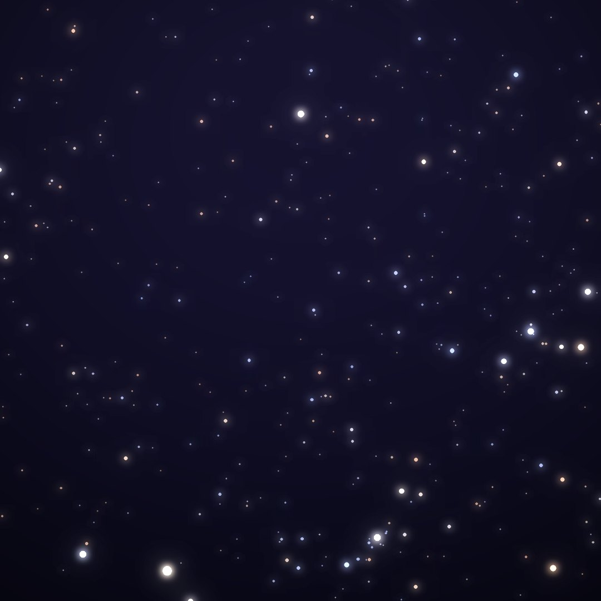
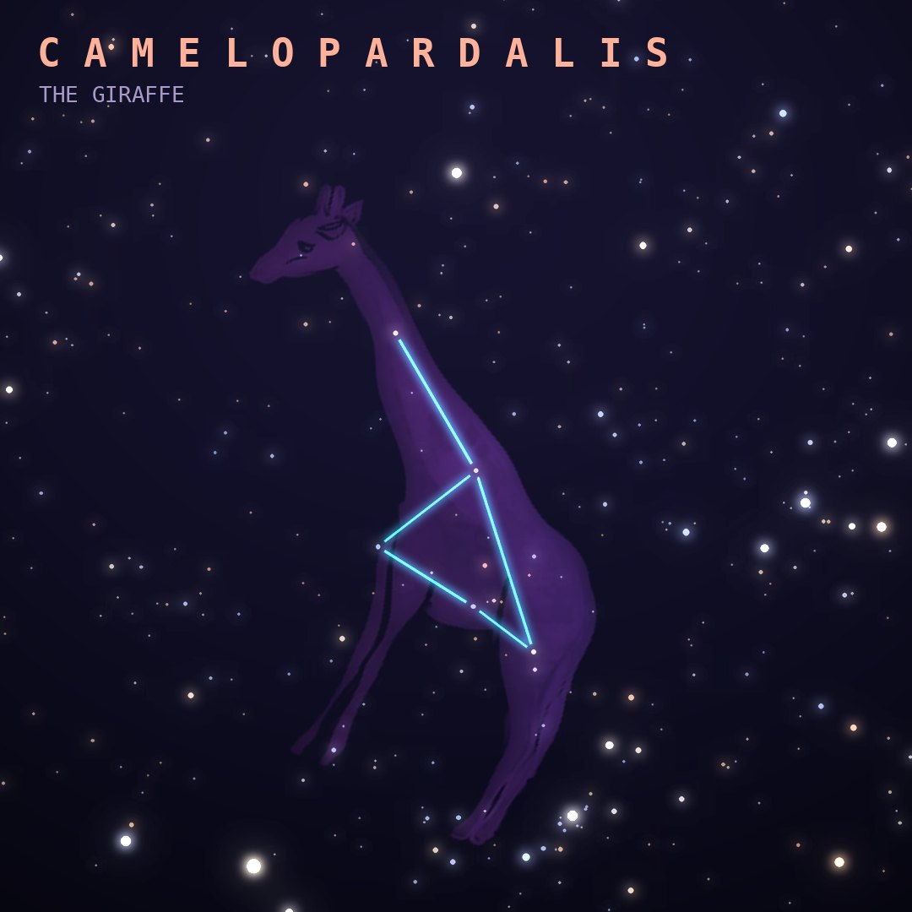

## Front

Which constellation is this?

## Back
# Camelopardalis
*The Giraffe* · Cam · genitive *Camelopardalis*

A large but faint northern constellation introduced by Petrus Plancius in 1612. Its name comes from the Greek for "camel-leopard", the old name for a giraffe.

- **Brightest star:** β Camelopardalis, magnitude 4.0
- **Best seen:** January evenings
- **Fully visible:** between 90°N and 10°S

> **Fun fact:** It contains Kemble's Cascade, a straight line of about 20 stars that looks like a waterfall tumbling into a small star cluster through binoculars.
