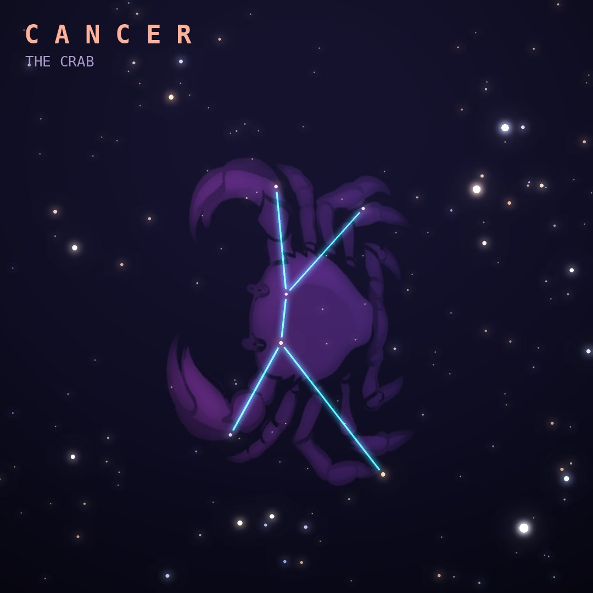

## Front

Which constellation is this?

## Back
# Cancer
*The Crab* · Cnc · genitive *Cancri*

The faintest zodiac constellation: the crab Hera sent to nip at Heracles while he fought the Hydra, crushed under the hero's foot.

- **Brightest star:** Tarf (β Cancri), magnitude 3.5
- **Best seen:** March evenings
- **Fully visible:** between 90°N and 55°S

> **Fun fact:** It holds the Beehive Cluster (M44), a naked-eye smudge of stars, and gave its name to the Tropic of Cancer because the Sun stood here at the June solstice about 2,000 years ago.
