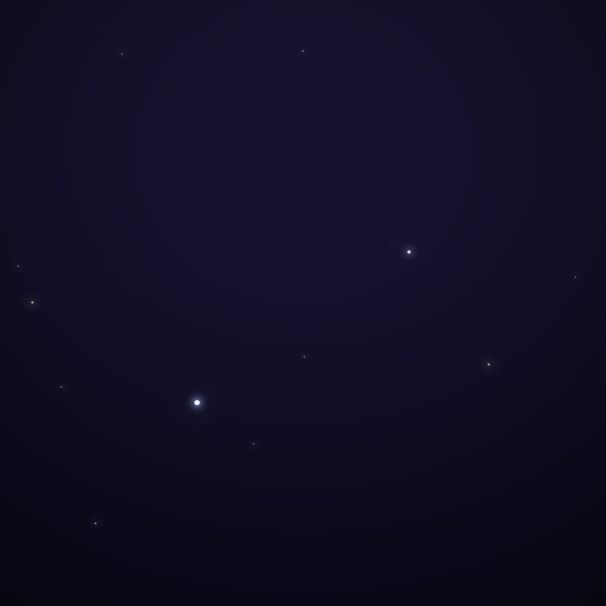
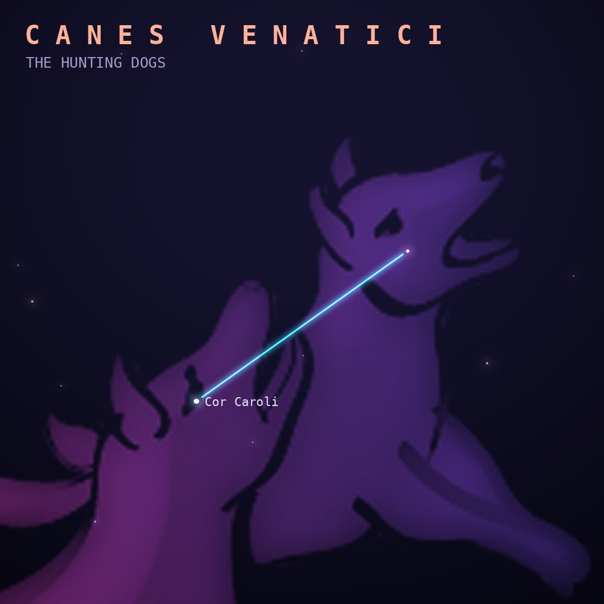

## Front

Which constellation is this?

## Back
# Canes Venatici
*The Hunting Dogs* · CVn · genitive *Canum Venaticorum*

The two dogs held on a leash by Boötes the herdsman, created by Johannes Hevelius in 1687 from faint stars beneath the Big Dipper's handle.

- **Brightest star:** Cor Caroli (α2 Canum Venaticorum), magnitude 2.9
- **Best seen:** May evenings
- **Fully visible:** between 90°N and 40°S

> **Fun fact:** It contains the Whirlpool Galaxy (M51), the first galaxy in which spiral arms were seen, sketched by Lord Rosse in 1845. Its brightest star, Cor Caroli, honors King Charles of England.
