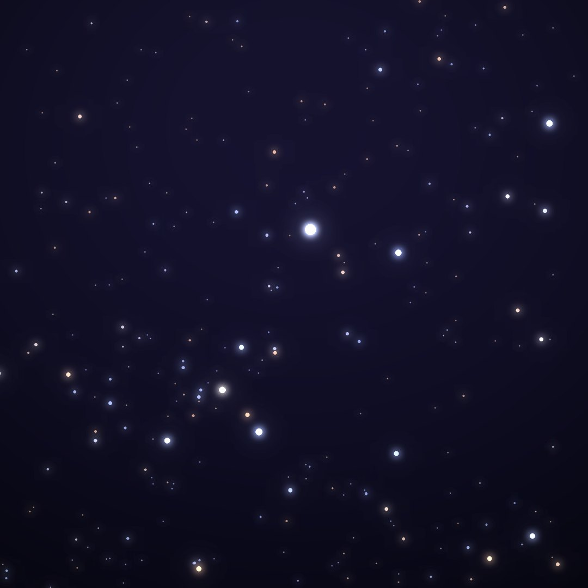
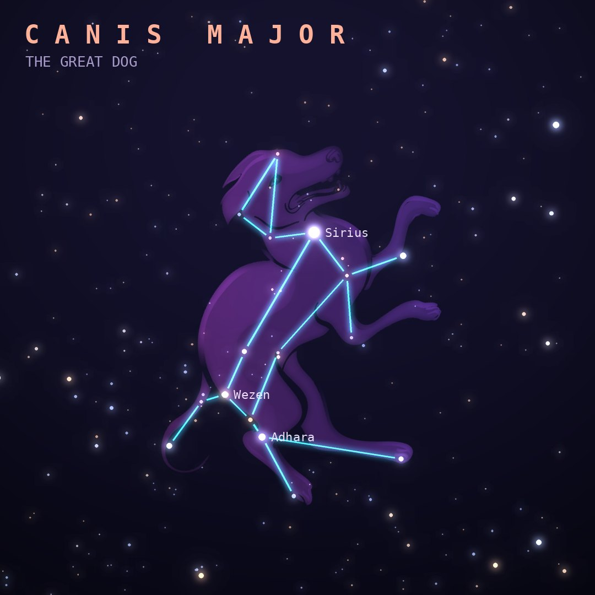

## Front

Which constellation is this?

## Back
# Canis Major
*The Great Dog* · CMa · genitive *Canis Majoris*

Orion's larger hunting dog, trotting at his heels. It holds Sirius, the brightest star in the night sky, only 8.6 light-years away.

- **Brightest star:** Sirius (α Canis Majoris), magnitude −1.4
- **Best seen:** February evenings
- **Fully visible:** between 55°N and 90°S

> **Fun fact:** In ancient Egypt Sirius rising before dawn announced the Nile flood, and the "dog days" of summer are named for the Dog Star's appearance with the Sun.
