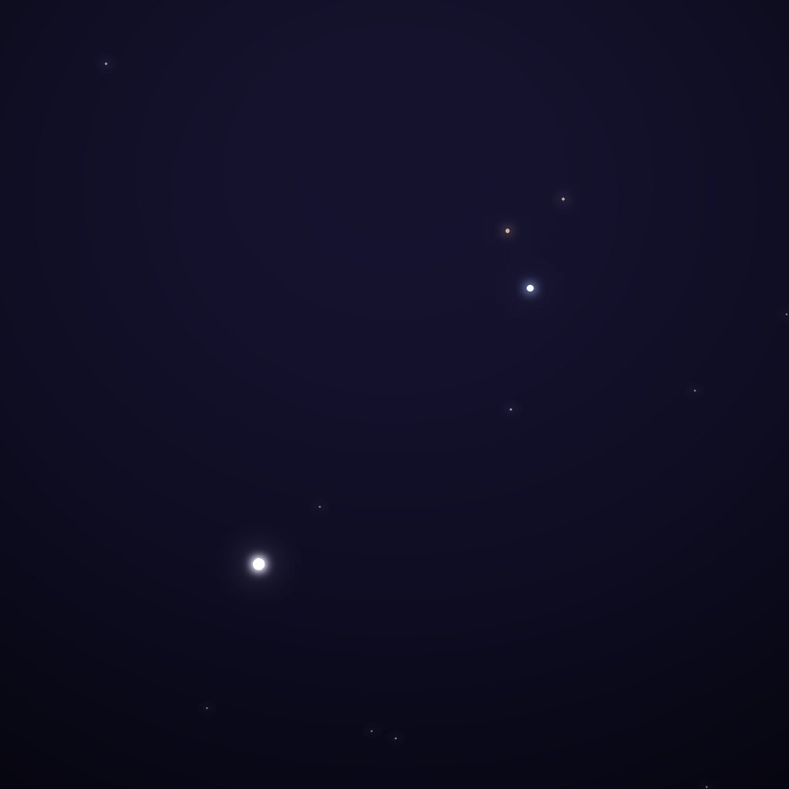
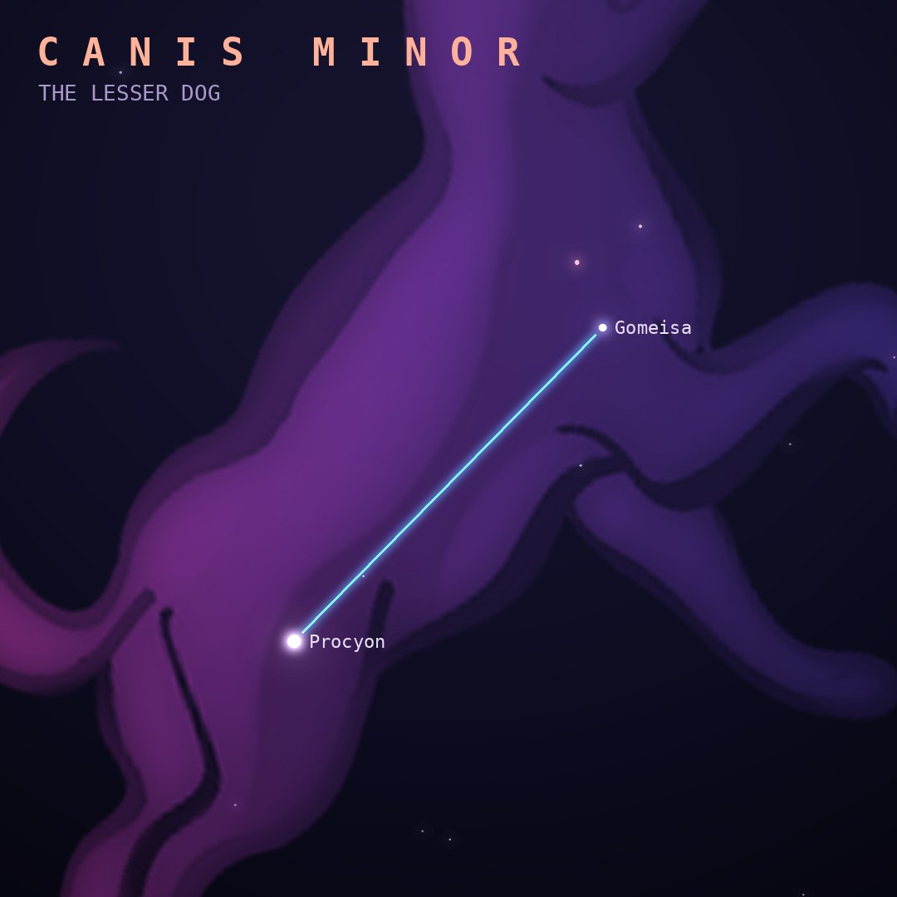

## Front

Which constellation is this?

## Back
# Canis Minor
*The Lesser Dog* · CMi · genitive *Canis Minoris*

Orion's smaller dog, which is mostly just two stars: Procyon and Gomeisa. Procyon forms the Winter Triangle with Sirius and Betelgeuse.

- **Brightest star:** Procyon (α Canis Minoris), magnitude 0.4
- **Best seen:** February evenings
- **Fully visible:** between 90°N and 80°S

> **Fun fact:** Procyon means "before the dog" in Greek, because from mid-northern latitudes it rises shortly before Sirius, the Dog Star.
