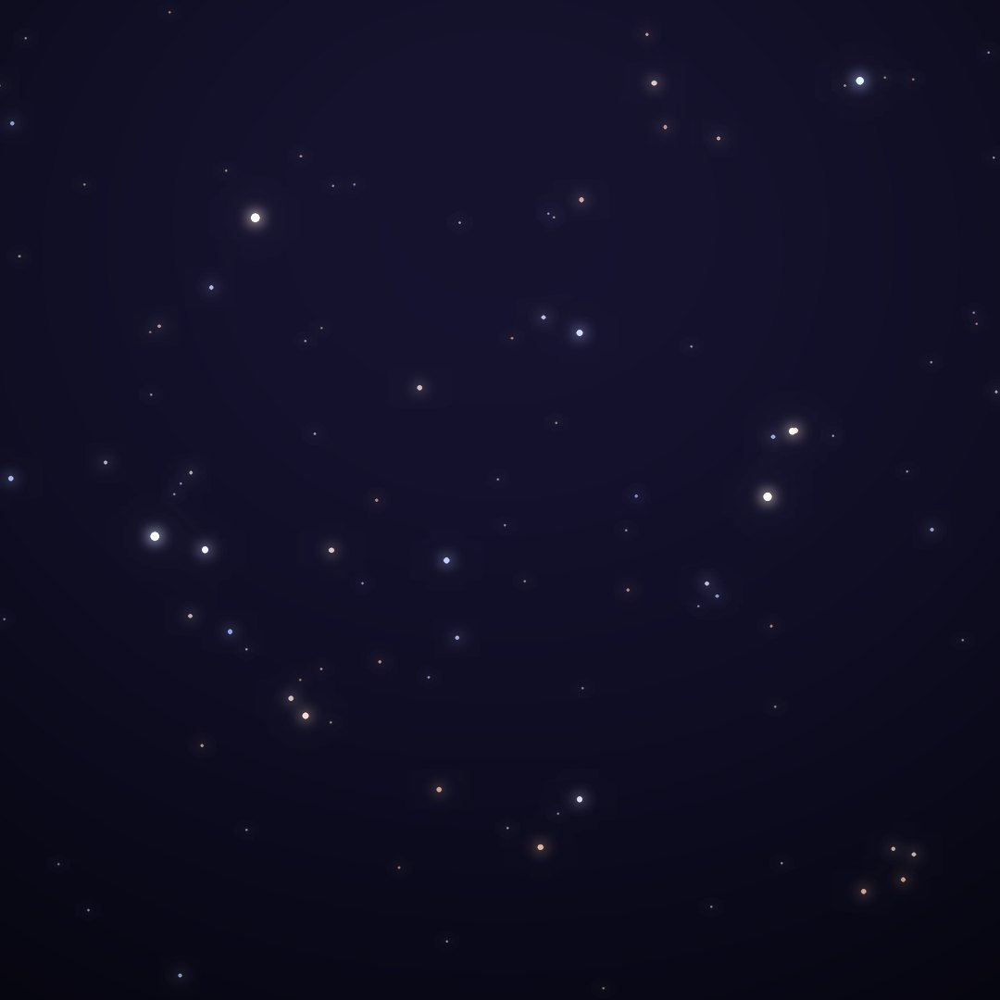
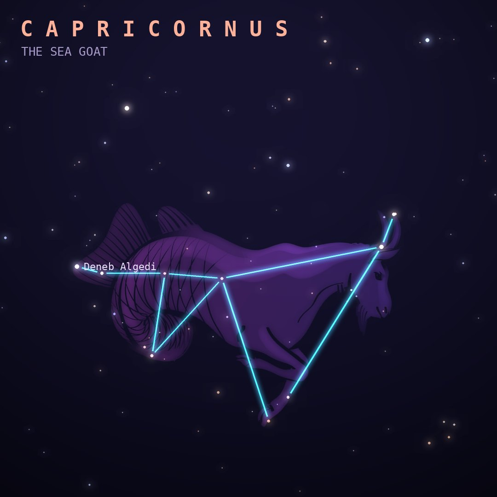

## Front

Which constellation is this?

## Back
# Capricornus
*The Sea Goat* · Cap · genitive *Capricorni*

A zodiac constellation shaped like a goat with a fish's tail, linked to the god Pan, who leapt into the Nile and turned half-fish to escape the monster Typhon.

- **Brightest star:** Deneb Algedi (δ Capricorni), magnitude 2.9
- **Best seen:** September evenings
- **Fully visible:** between 65°N and 90°S

> **Fun fact:** The Tropic of Capricorn is named after it because the Sun stood in Capricornus at the December solstice about 2,000 years ago. Today it is in Sagittarius on that date.
