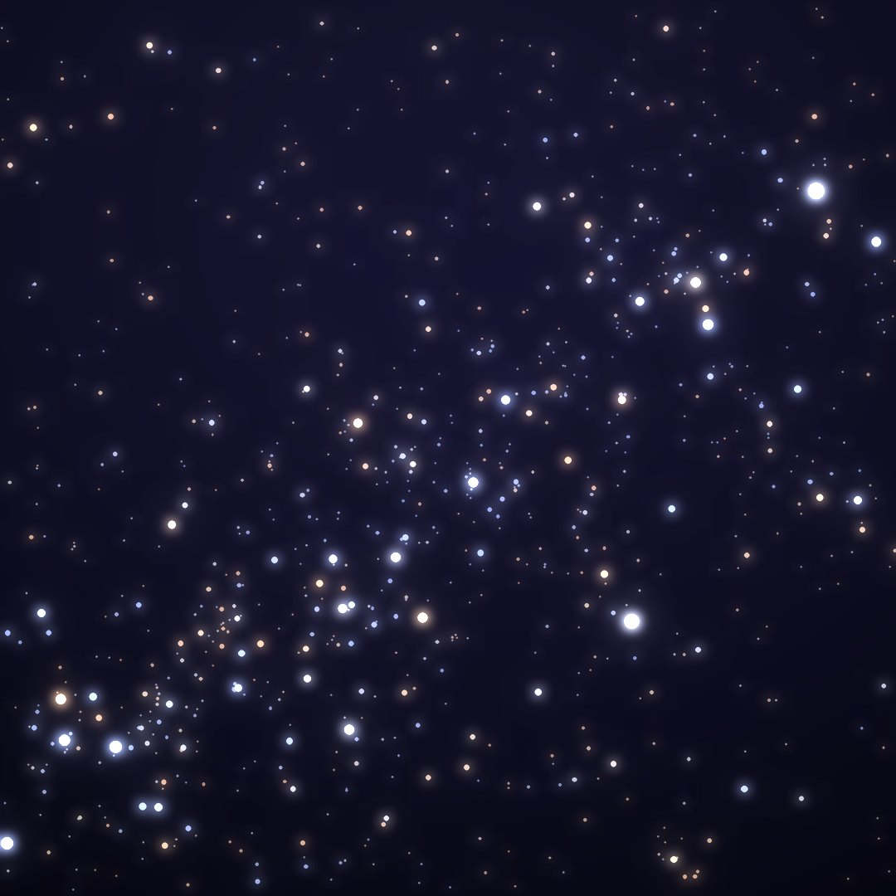
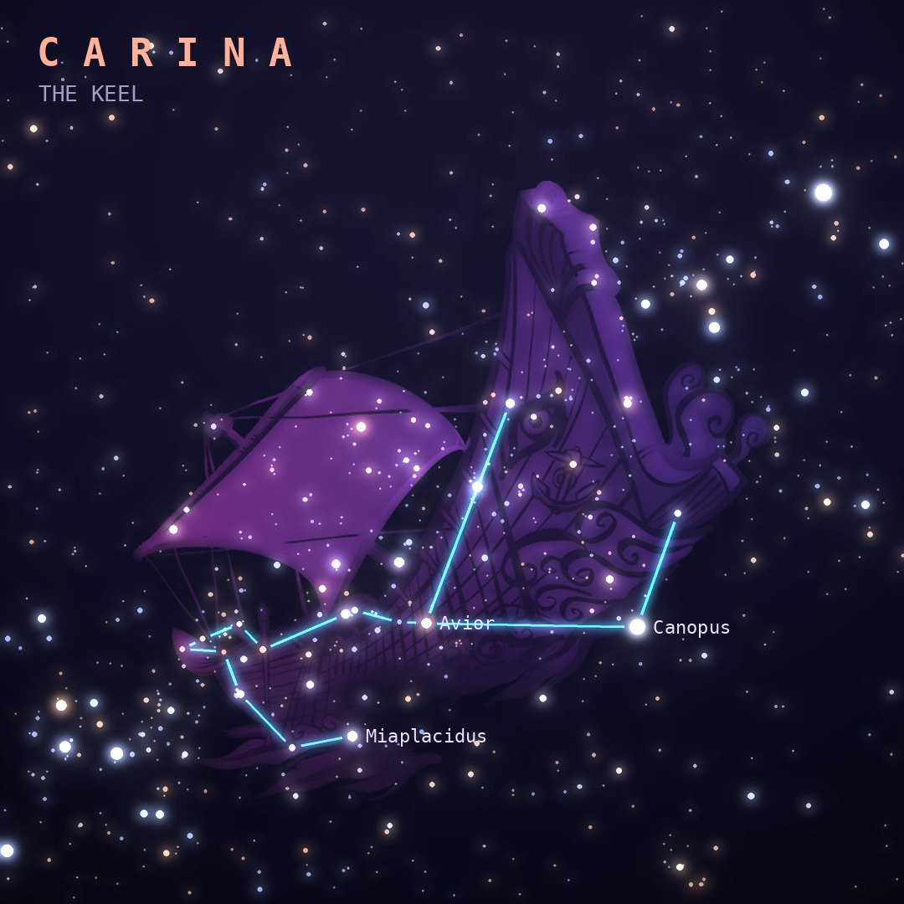

## Front

Which constellation is this?

## Back
# Carina
*The Keel* · Car · genitive *Carinae*

The keel of Jason's ship Argo Navis, a giant ancient constellation that Lacaille split into Carina, Puppis and Vela. It holds Canopus, the second-brightest star in the night sky.

- **Brightest star:** Canopus (α Carinae), magnitude −0.6
- **Best seen:** March evenings
- **Fully visible:** between 15°N and 90°S

> **Fun fact:** The monster star system Eta Carinae erupted in the 1840s and briefly became the second-brightest star in the sky, throwing off a glowing double cloud called the Homunculus Nebula.
