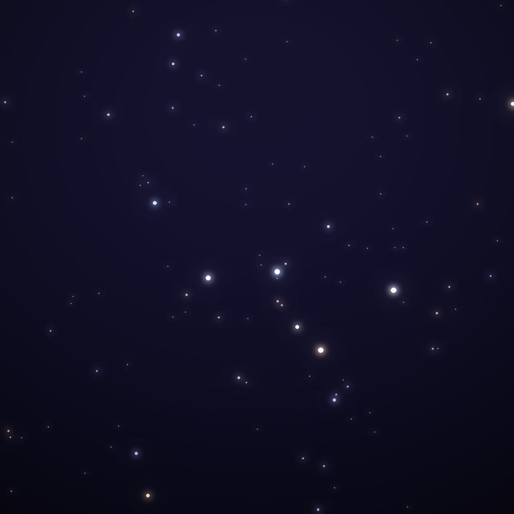
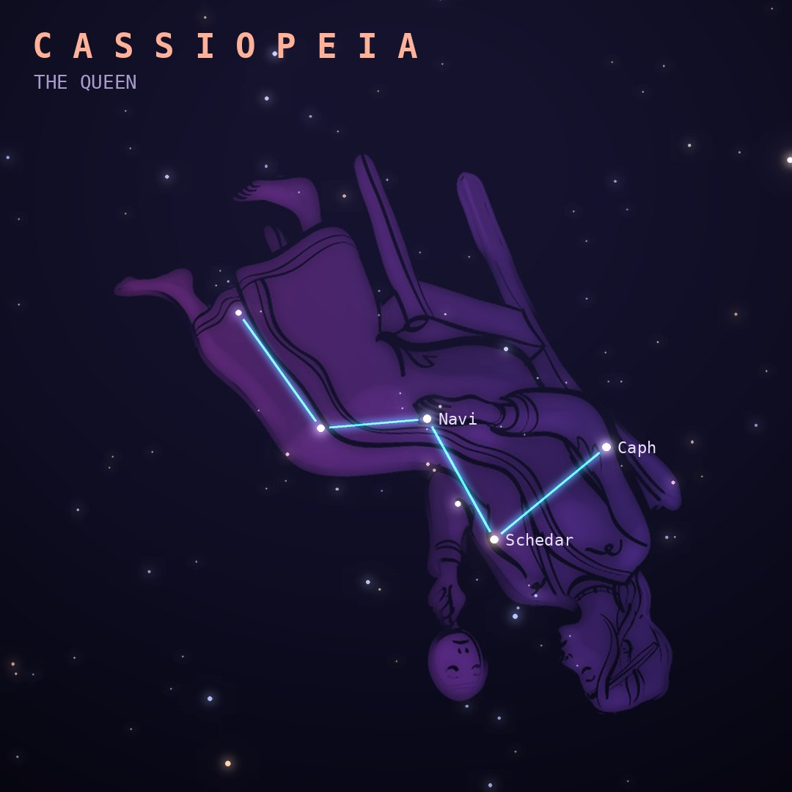

## Front

Which constellation is this?

## Back
# Cassiopeia
*The Queen* · Cas · genitive *Cassiopeiae*

The vain queen of Aethiopia who boasted that she was more beautiful than the sea nymphs. Her five bright stars form an easy "W" that circles the north pole, upside down half the time.

- **Brightest star:** Navi (γ Cassiopeiae), magnitude 2.1
- **Best seen:** November evenings
- **Fully visible:** between 90°N and 15°S

> **Fun fact:** In 1572 Tycho Brahe watched a "new star" blaze up in Cassiopeia. That supernova proved the heavens could change and helped overturn the ancient idea of fixed, perfect skies.
