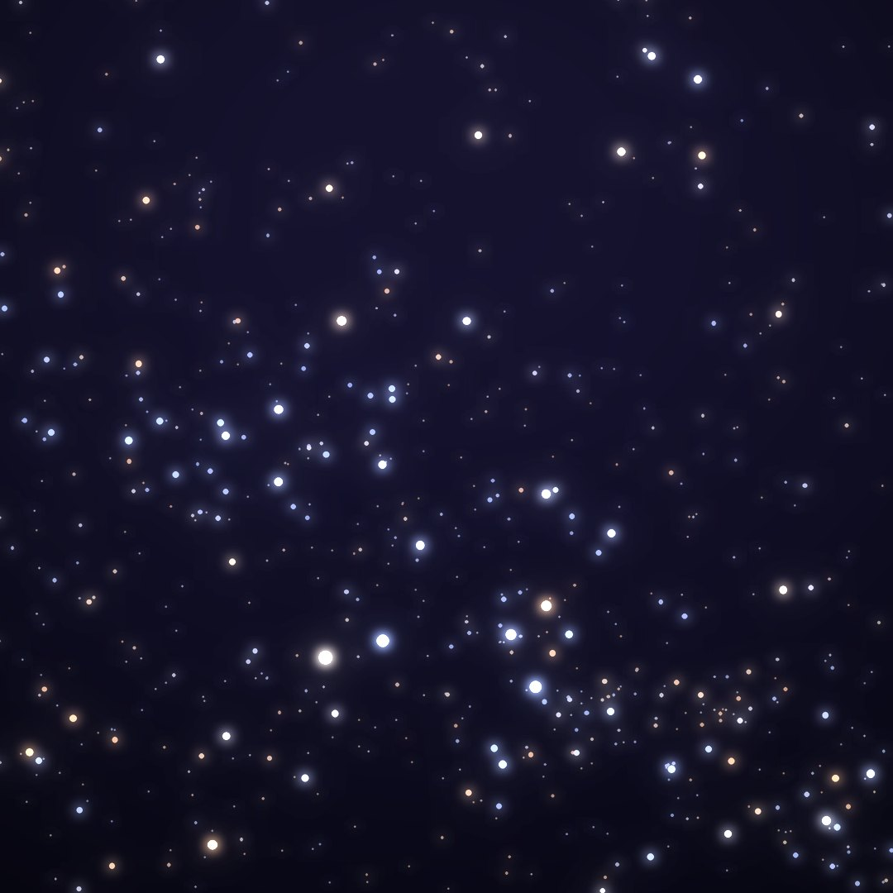
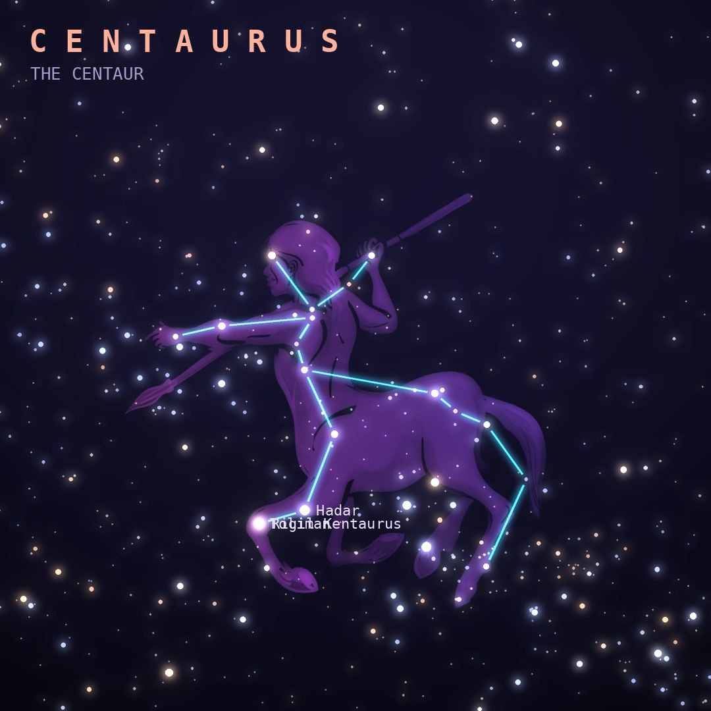

## Front

Which constellation is this?

## Back
# Centaurus
*The Centaur* · Cen · genitive *Centauri*

A large southern constellation, often identified as Chiron, the wise centaur who tutored heroes like Achilles and Jason. Its two brightest stars point toward the Southern Cross.

- **Brightest star:** Rigil Kentaurus (α1 Centauri), magnitude 0.0
- **Best seen:** May evenings
- **Fully visible:** between 25°N and 90°S

> **Fun fact:** Alpha Centauri is the nearest star system to the Sun, 4.4 light-years away, and its faint companion Proxima Centauri is the closest star of all. Centaurus also holds Omega Centauri, the Milky Way's biggest globular cluster.
