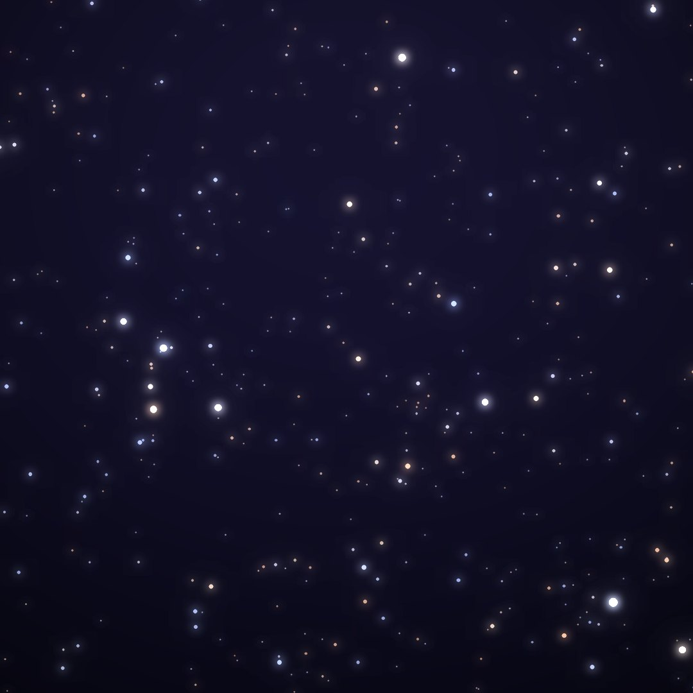
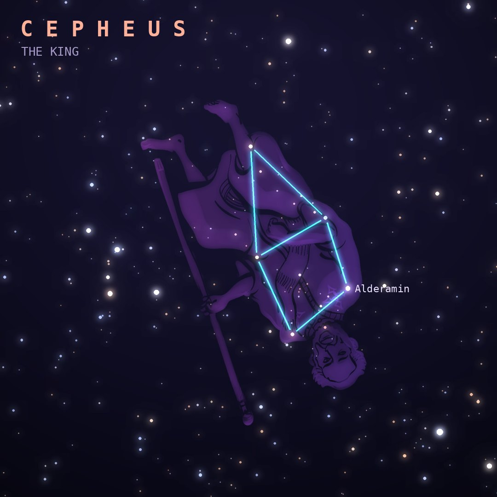

## Front

Which constellation is this?

## Back
# Cepheus
*The King* · Cep · genitive *Cephei*

King of Aethiopia, husband of Cassiopeia and father of Andromeda. Its stars trace a simple house with a pointed roof near the north celestial pole.

- **Brightest star:** Alderamin (α Cephei), magnitude 2.5
- **Best seen:** October evenings
- **Fully visible:** between 90°N and 5°S

> **Fun fact:** Delta Cephei is the prototype Cepheid variable: its pulsation period reveals its true brightness, the cosmic yardstick Henrietta Leavitt found and Edwin Hubble used to measure distances to other galaxies.
