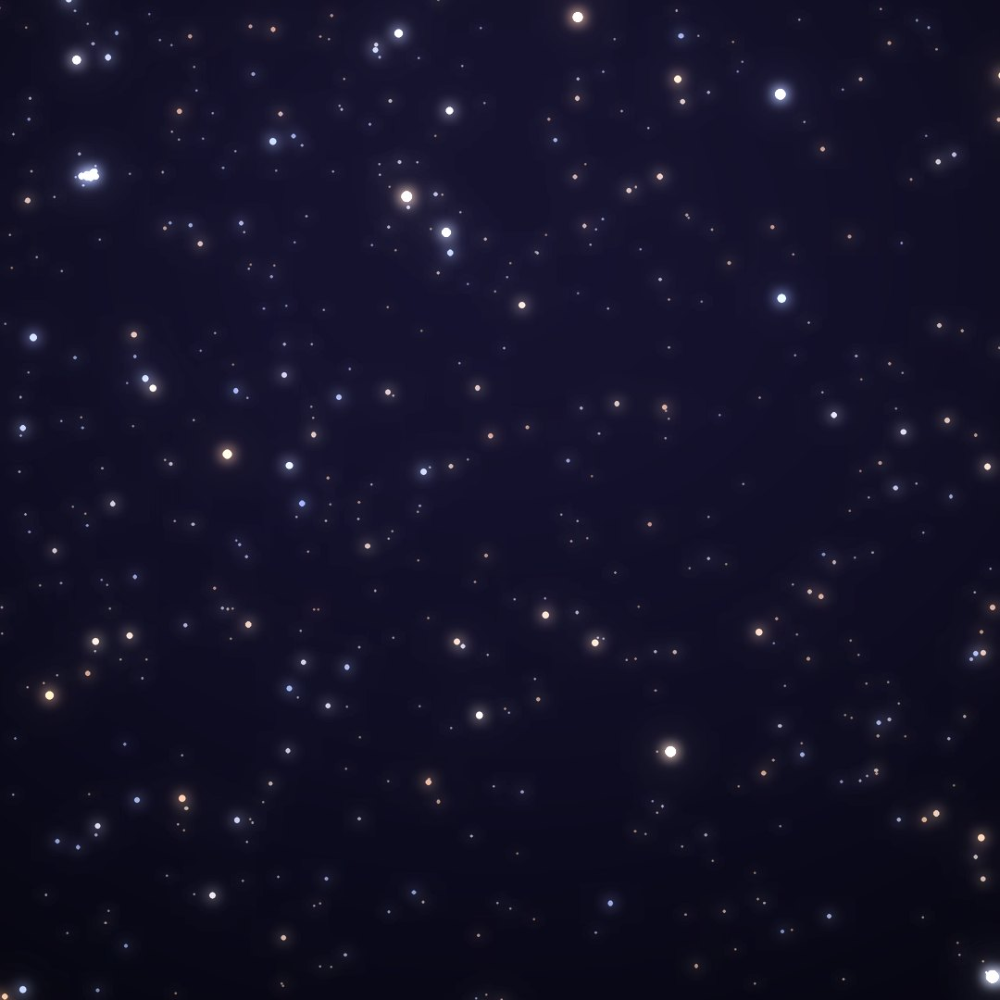
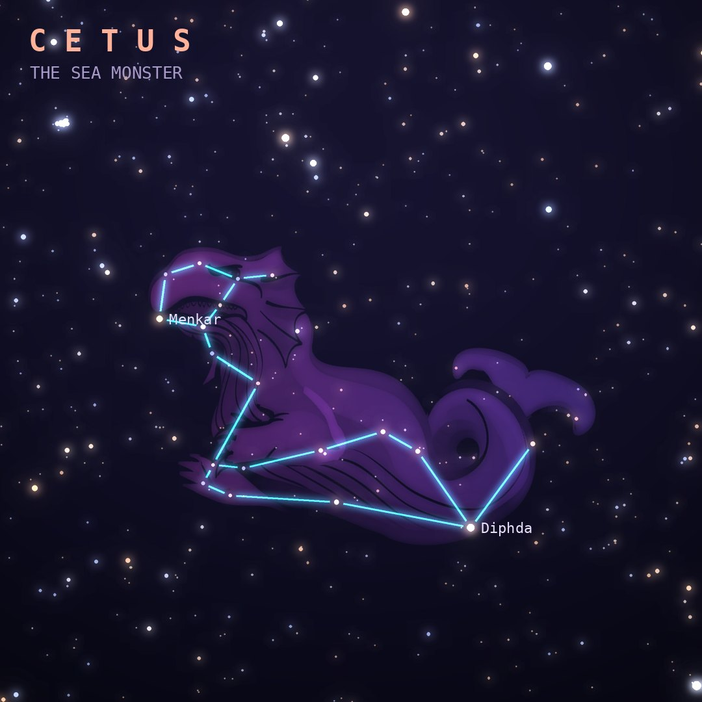

## Front

Which constellation is this?

## Back
# Cetus
*The Sea Monster* · Cet · genitive *Ceti*

The sea monster Poseidon sent to devour Andromeda, turned to stone by Perseus with Medusa's head. It is the fourth-largest constellation.

- **Brightest star:** Diphda (β Ceti), magnitude 2.0
- **Best seen:** December evenings
- **Fully visible:** between 65°N and 80°S

> **Fun fact:** Its star Mira, "the wonderful", was the first variable star recognized (in 1596). Over about 11 months it swings from easily visible to far too faint to see without a telescope.
