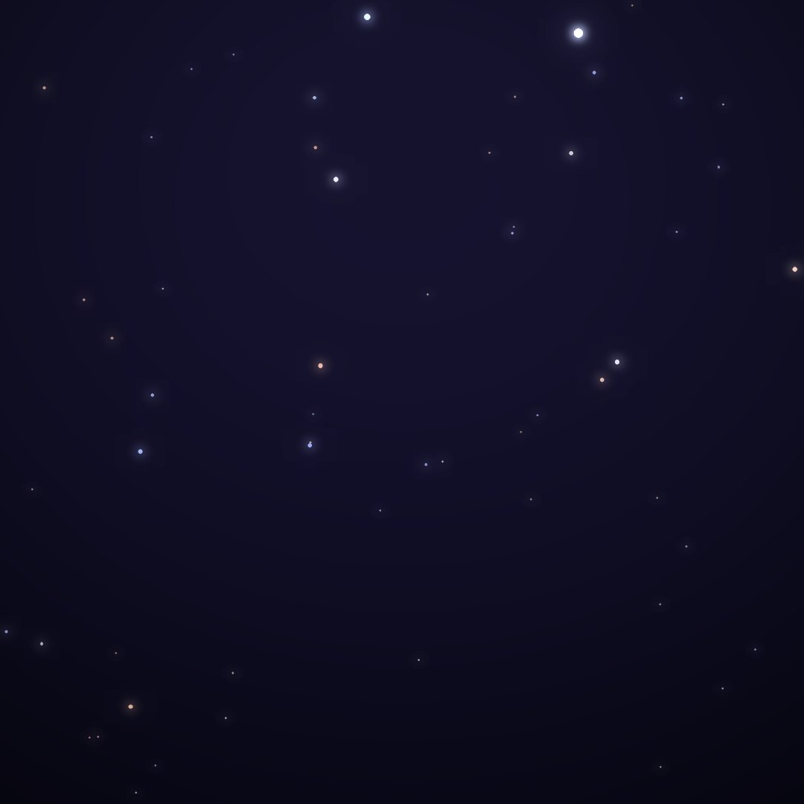
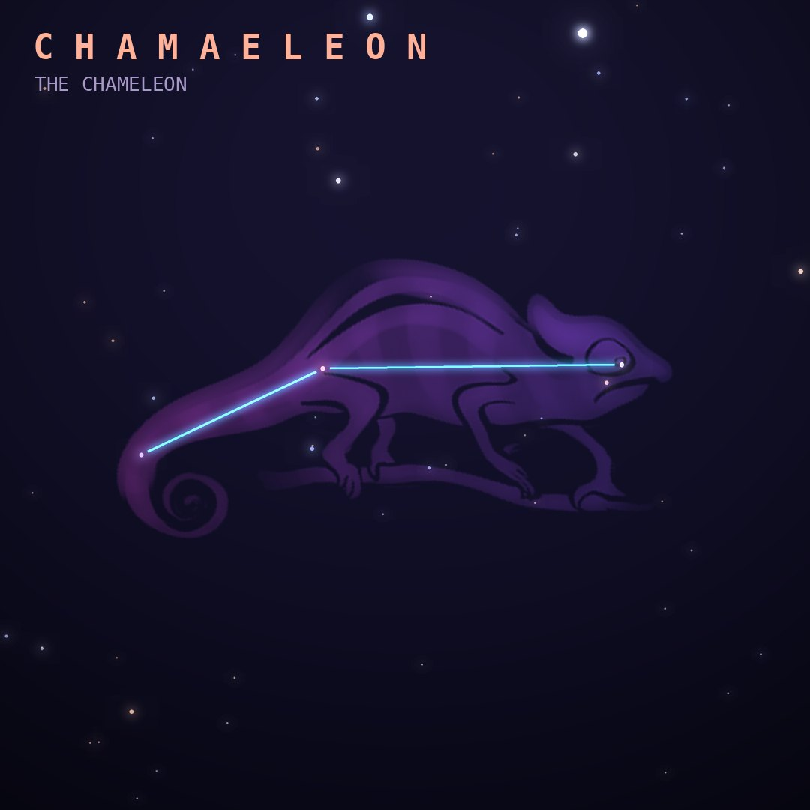

## Front

Which constellation is this?

## Back
# Chamaeleon
*The Chameleon* · Cha · genitive *Chamaeleontis*

A small, faint constellation near the south celestial pole, introduced from the observations of Dutch navigators Keyser and de Houtman in the 1590s.

- **Brightest star:** α Chamaeleontis, magnitude 4.0
- **Best seen:** April evenings
- **Fully visible:** between 10°N and 90°S

> **Fun fact:** It hides the Chamaeleon dark clouds, one of the nearest star-forming regions to the Sun, where hundreds of newborn stars are still emerging from dust.
