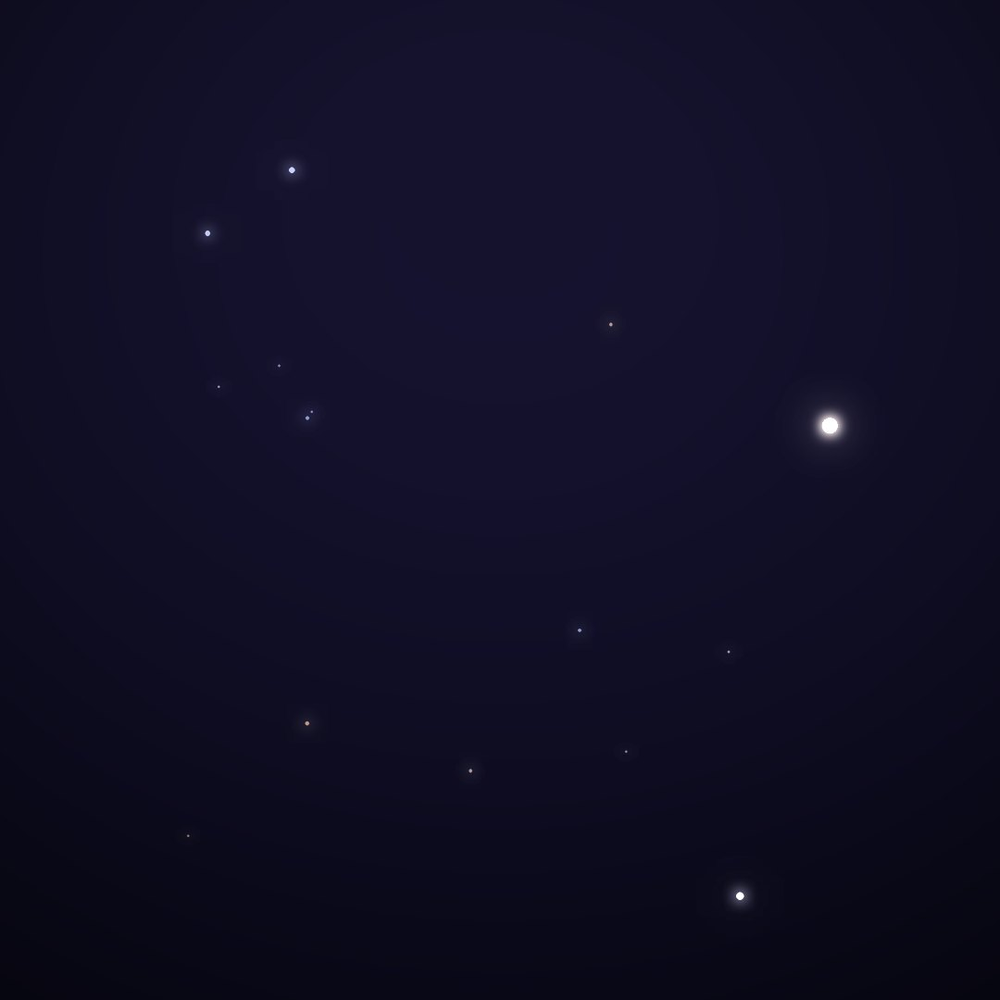
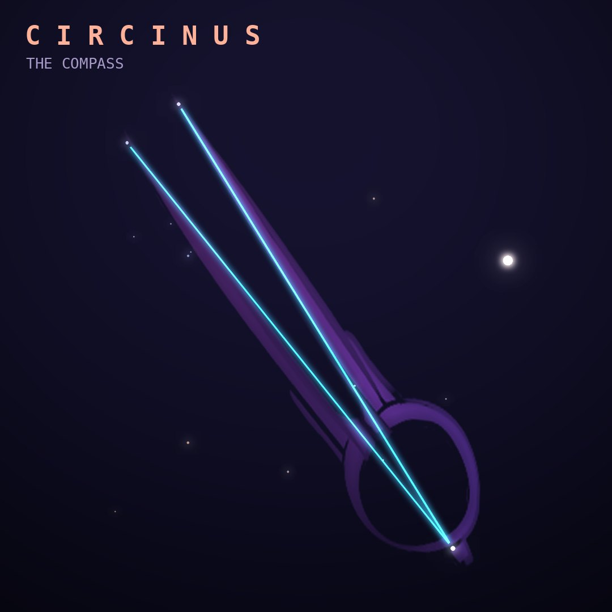

## Front

Which constellation is this?

## Back
# Circinus
*The Compass* · Cir · genitive *Circini*

One of Lacaille's instruments: a drafting compass, the kind used to draw circles. It is a tiny constellation tucked right beside Alpha Centauri.

- **Brightest star:** α Circini, magnitude 3.2
- **Best seen:** June evenings
- **Fully visible:** between 25°N and 90°S

> **Fun fact:** The Circinus Galaxy, one of the closest galaxies with a feeding black hole, hid behind the Milky Way's dust until astronomers found it in 1977.
