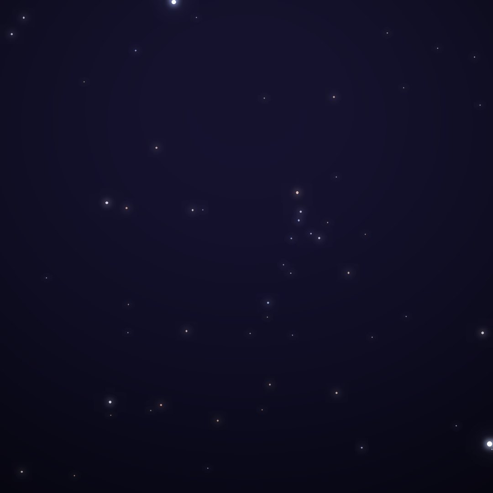

## Front

Which constellation is this?

## Back
# Coma Berenices
*Berenice's Hair* · Com · genitive *Comae Berenices*

Queen Berenice II of Egypt cut off her hair as an offering for her husband's safe return from war. When it vanished from the temple, the court astronomer declared that the gods had placed it in the sky. It is the only constellation named after a historical person.

- **Brightest star:** β Comae Berenices, magnitude 4.2
- **Best seen:** May evenings
- **Fully visible:** between 90°N and 60°S

> **Fun fact:** Behind it lies the Coma Cluster of thousands of galaxies. In 1933 Fritz Zwicky noticed that its galaxies move too fast for their visible mass, the first evidence of dark matter.
