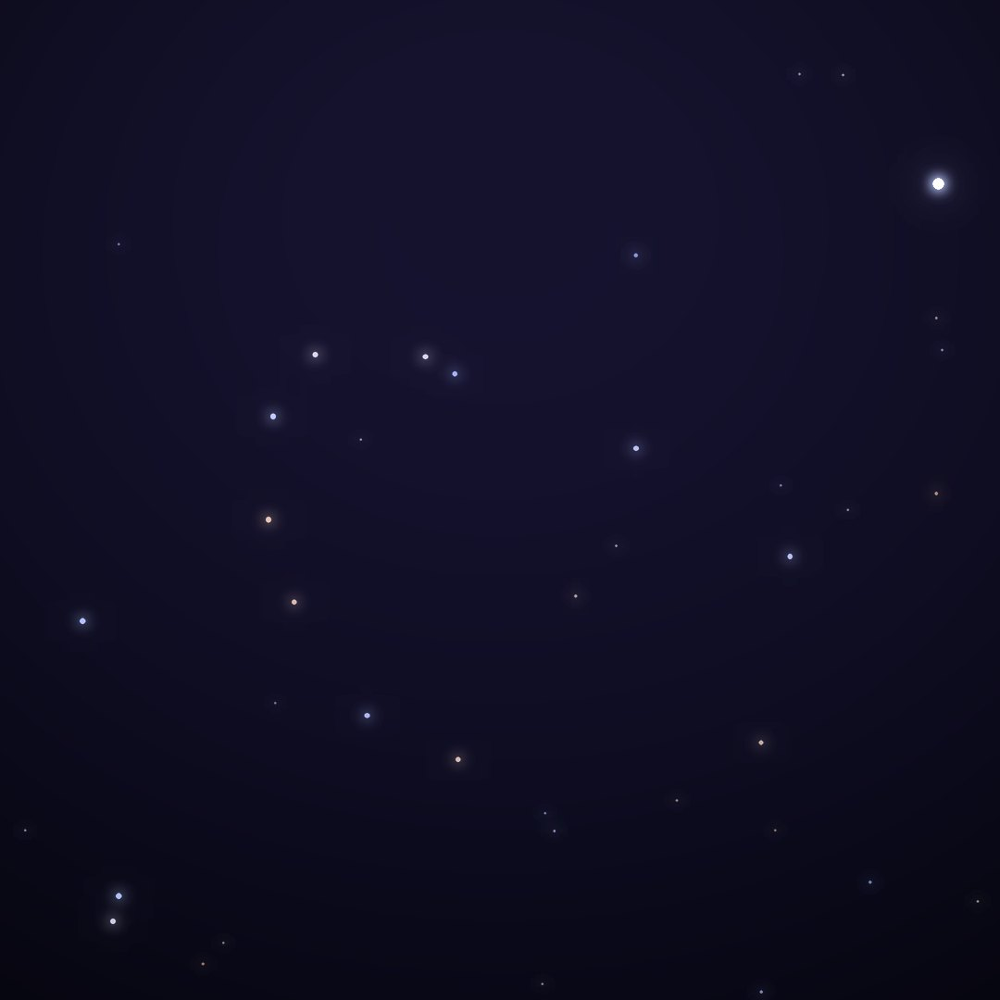
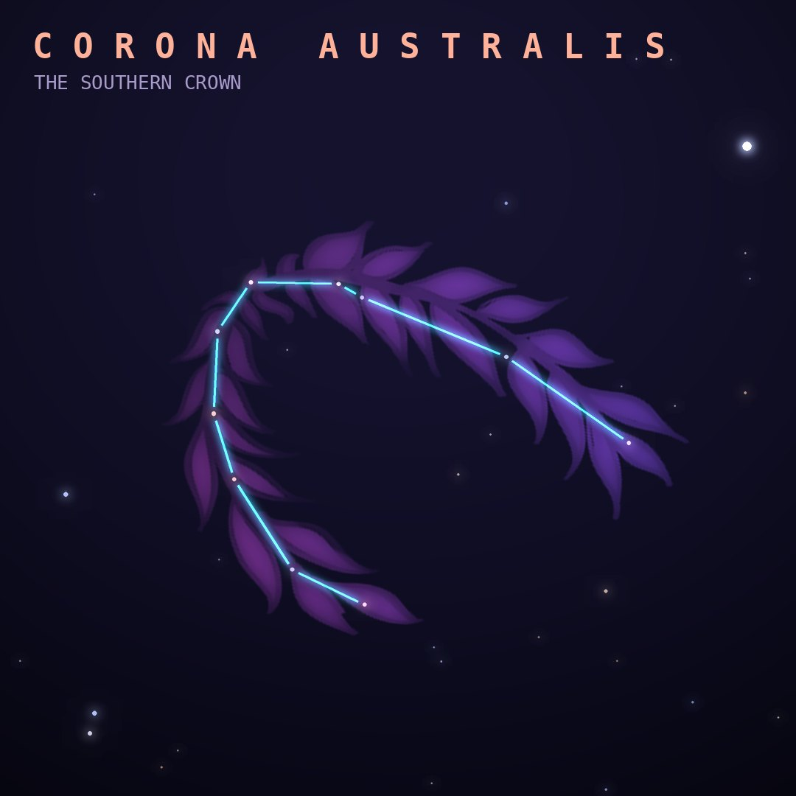

## Front

Which constellation is this?

## Back
# Corona Australis
*The Southern Crown* · CrA · genitive *Coronae Australis*

A graceful arc of faint stars below Sagittarius, one of the 48 constellations listed by Ptolemy. It is usually seen as a wreath or crown.

- **Brightest star:** β Coronae Australis, magnitude 4.1
- **Best seen:** August evenings
- **Fully visible:** between 45°N and 90°S

> **Fun fact:** The dark cloud near R Coronae Australis is one of the closest star nurseries to Earth, about 400 light-years away, full of stars only a few million years old.
