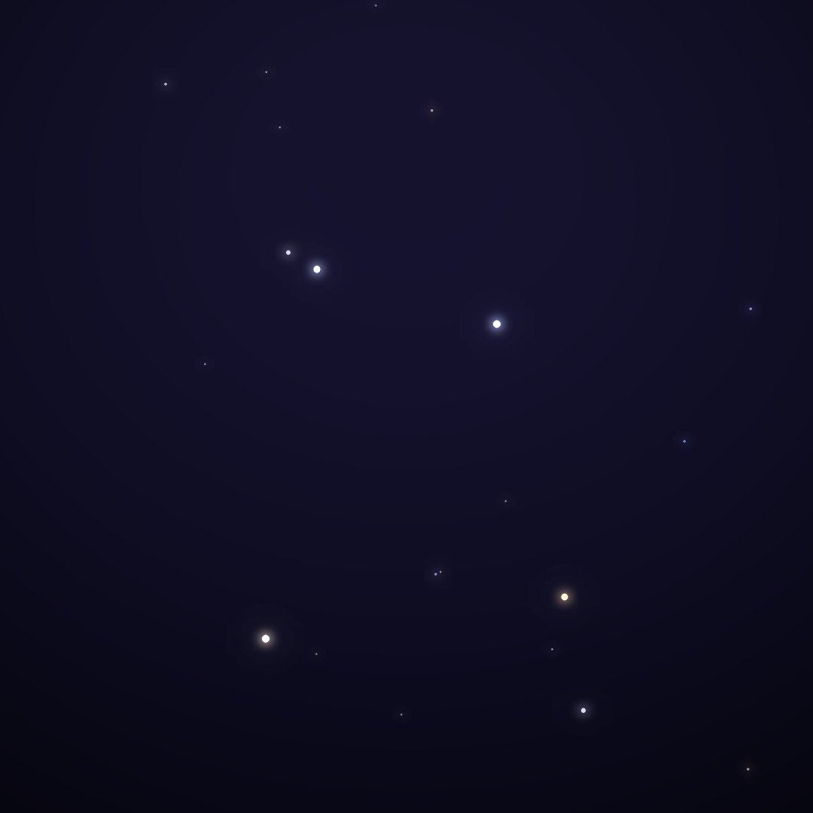
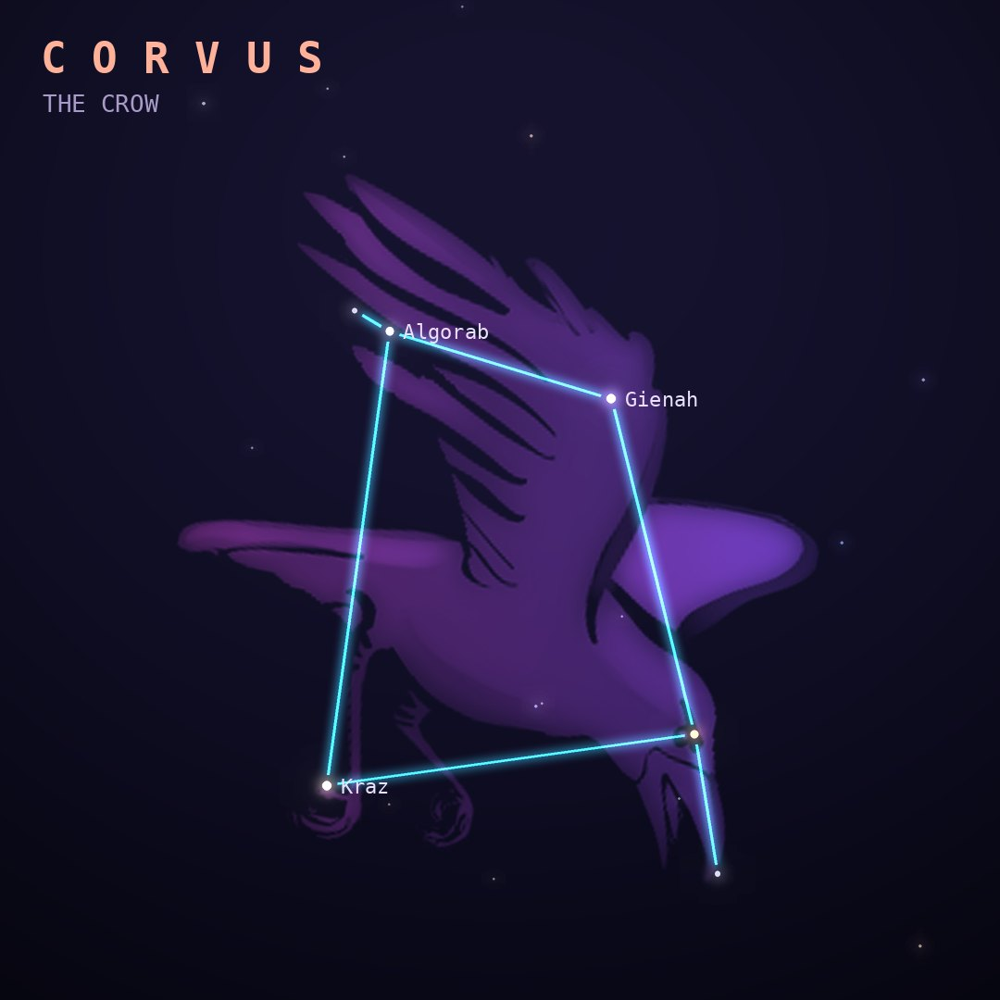

## Front

Which constellation is this?

## Back
# Corvus
*The Crow* · Crv · genitive *Corvi*

Apollo sent his crow to fetch water in a cup but it dawdled, then blamed a water snake. Apollo set the crow, the cup (Crater) and the snake (Hydra) in the sky, with the thirsty crow forever kept from the cup.

- **Brightest star:** Gienah (γ Corvi), magnitude 2.6
- **Best seen:** May evenings
- **Fully visible:** between 65°N and 90°S

> **Fun fact:** The Antennae Galaxies in Corvus are two galaxies in mid-collision, flinging out long tails of stars that look like an insect's antennae.
