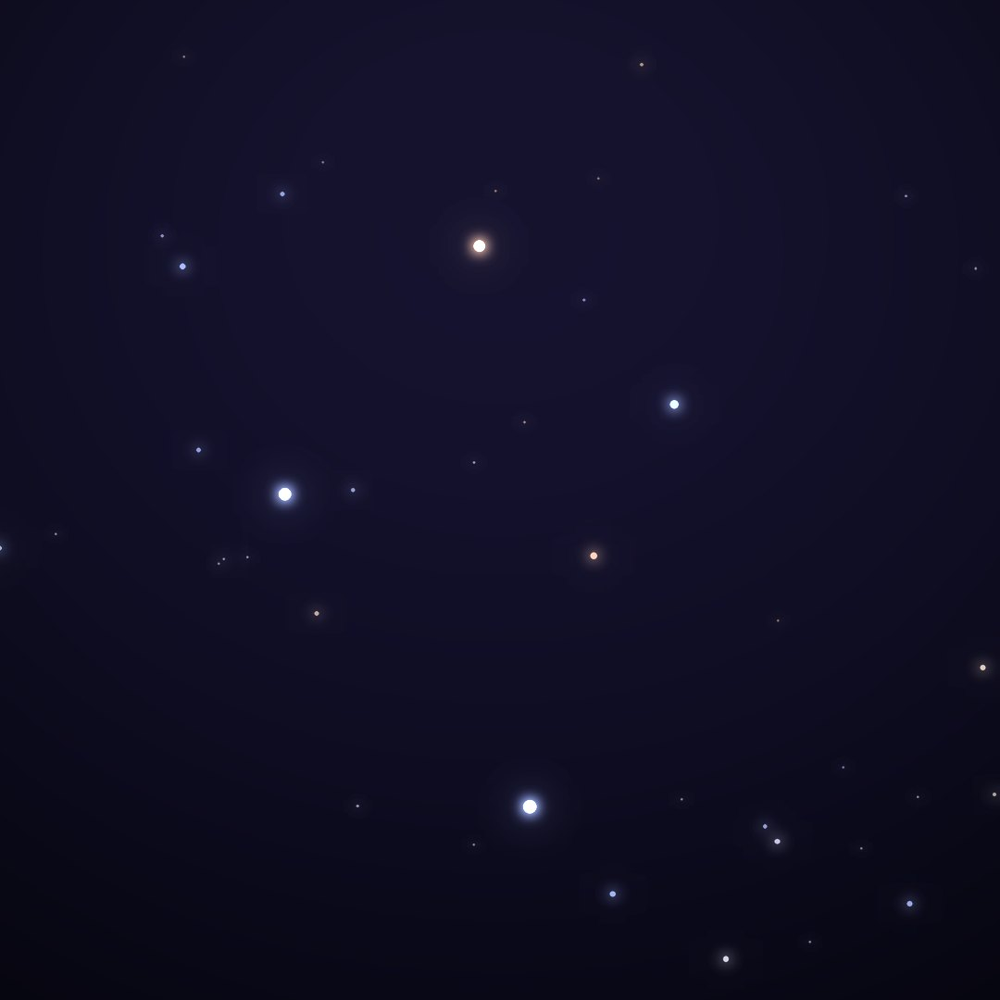
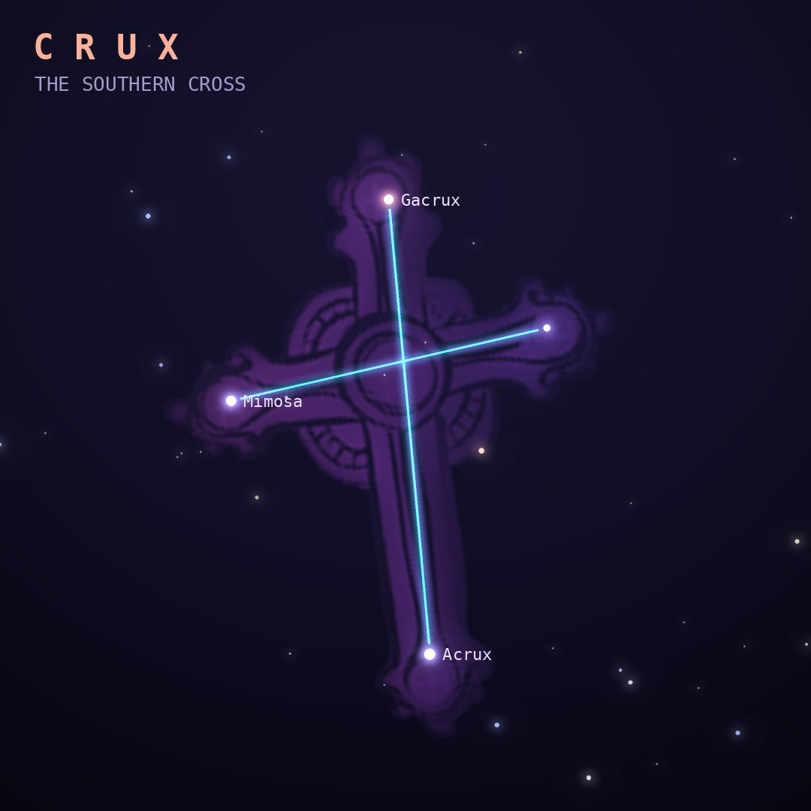

## Front

Which constellation is this?

## Back
# Crux
*The Southern Cross* · Cru · genitive *Crucis*

The smallest of the 88 constellations, yet one of the most famous. Ptolemy counted its stars as part of Centaurus. Its long axis points toward the south celestial pole, which made it a navigator's guide.

- **Brightest star:** Acrux (α1 Crucis), magnitude 0.8
- **Best seen:** May evenings
- **Fully visible:** between 25°N and 90°S

> **Fun fact:** The Southern Cross appears on the flags of Australia, New Zealand, Brazil, Samoa and Papua New Guinea. Right beside it lies the Coalsack, a dark cloud that blots out the Milky Way.
