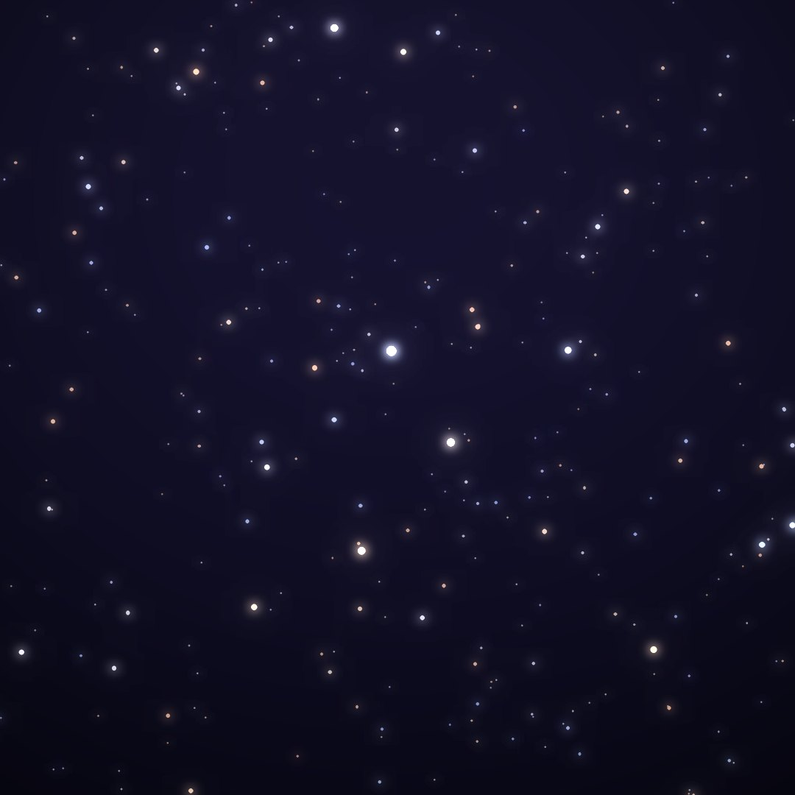
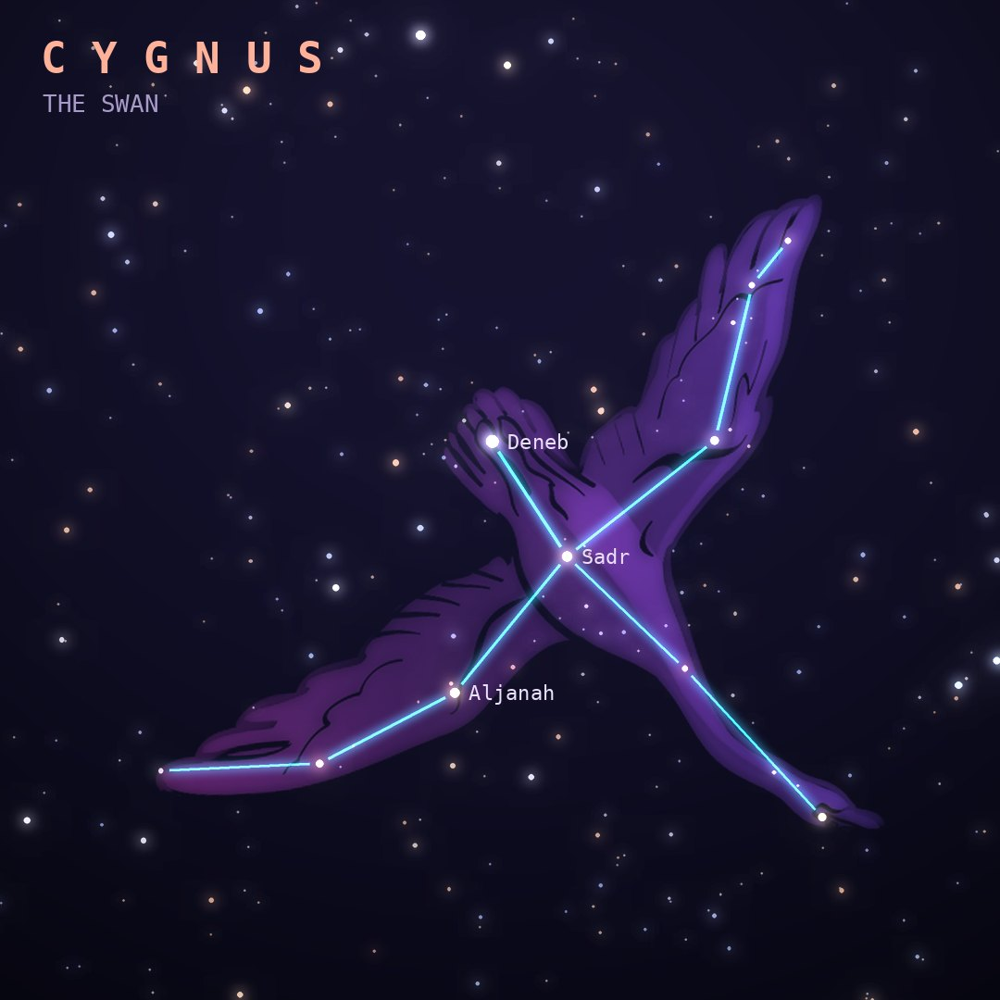

## Front

Which constellation is this?

## Back
# Cygnus
*The Swan* · Cyg · genitive *Cygni*

A swan, often Zeus in disguise, flying down the Milky Way. Its bright stars form the Northern Cross, and Deneb at its tail is a corner of the Summer Triangle.

- **Brightest star:** Deneb (α Cygni), magnitude 1.2
- **Best seen:** September evenings
- **Fully visible:** between 90°N and 30°S

> **Fun fact:** Cygnus X-1, discovered in the 1960s, became the first object widely accepted as a black hole. It is pulling gas off a giant blue companion star.
