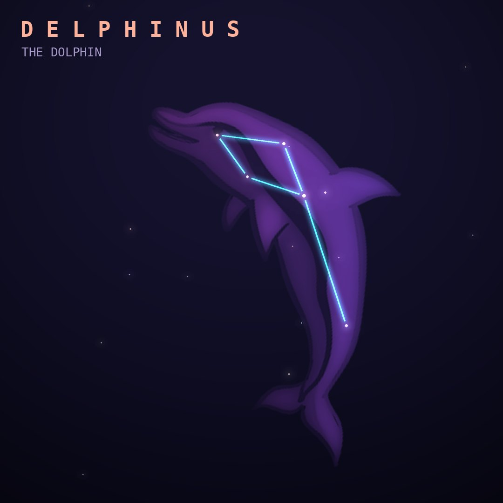

## Front

Which constellation is this?

## Back
# Delphinus
*The Dolphin* · Del · genitive *Delphini*

The dolphin that persuaded the sea nymph Amphitrite to marry Poseidon, or that saved the poet Arion. Its small diamond of stars is nicknamed "Job's Coffin".

- **Brightest star:** Rotanev (β Delphini), magnitude 3.6
- **Best seen:** September evenings
- **Fully visible:** between 90°N and 75°S

> **Fun fact:** Its stars Sualocin and Rotanev spell "Nicolaus Venator" backward, the Latin name of Niccolò Cacciatore, an astronomer's assistant who slipped his own name into an 1814 star catalog.
