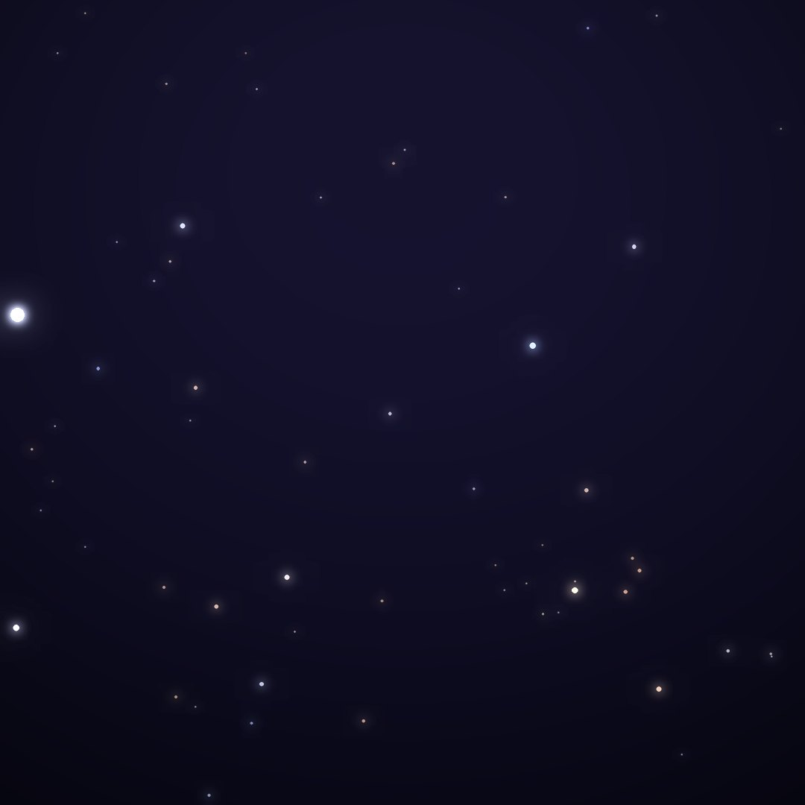
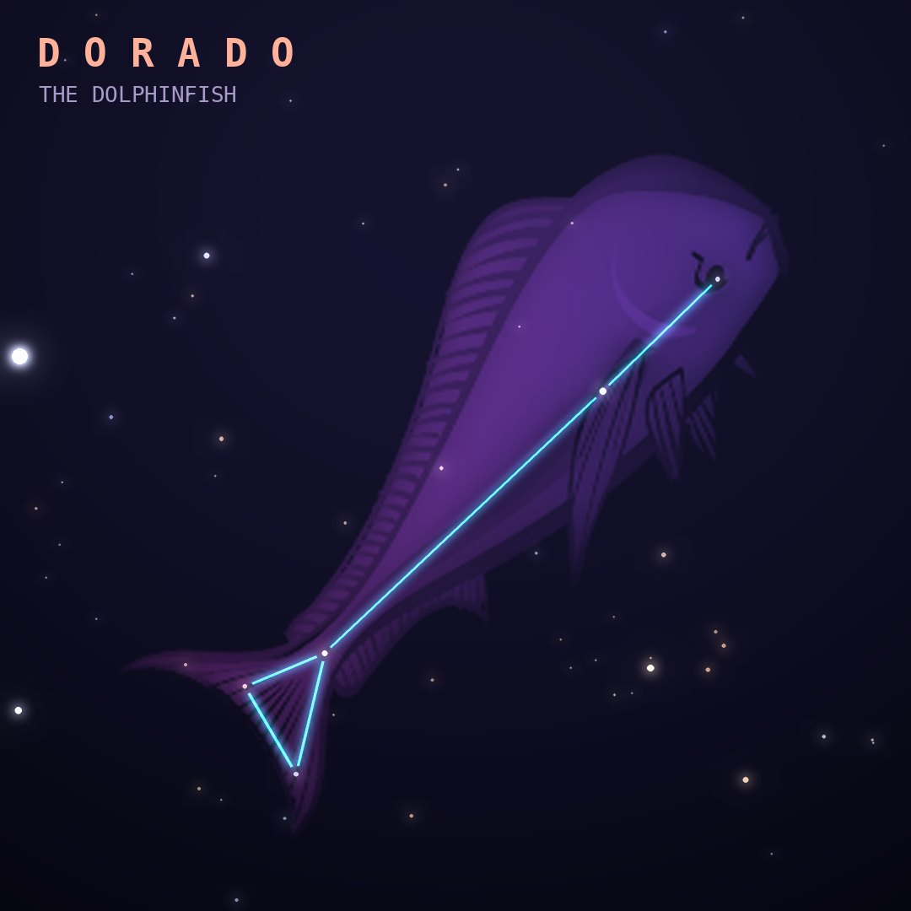

## Front

Which constellation is this?

## Back
# Dorado
*The Dolphinfish* · Dor · genitive *Doradus*

A dolphinfish (mahi-mahi), introduced from the observations of Dutch navigators Keyser and de Houtman in the 1590s. It contains most of the Large Magellanic Cloud.

- **Brightest star:** α Doradus, magnitude 3.3
- **Best seen:** January evenings
- **Fully visible:** between 20°N and 90°S

> **Fun fact:** In 1987 a star in the Large Magellanic Cloud exploded as Supernova 1987A, the closest supernova seen since the invention of the telescope, visible to the naked eye from the Southern Hemisphere.
