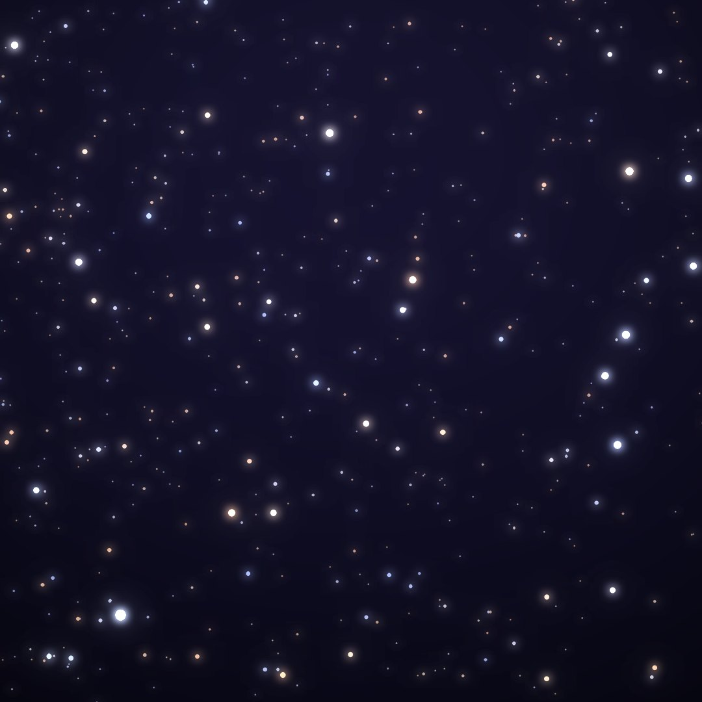
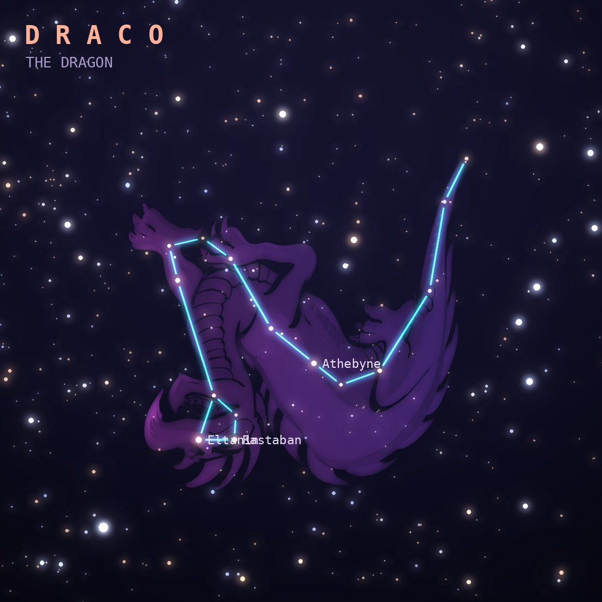

## Front

Which constellation is this?

## Back
# Draco
*The Dragon* · Dra · genitive *Draconis*

Ladon, the dragon that guarded the golden apples of the Hesperides until Heracles slew it. Its long body winds between the Big and Little Dippers.

- **Brightest star:** Eltanin (γ Draconis), magnitude 2.2
- **Best seen:** July evenings
- **Fully visible:** between 90°N and 5°S

> **Fun fact:** Its star Thuban was the North Star around 2800 BC, when Egyptians were building the pyramids. Earth's slow wobble has since moved the pole toward Polaris.
