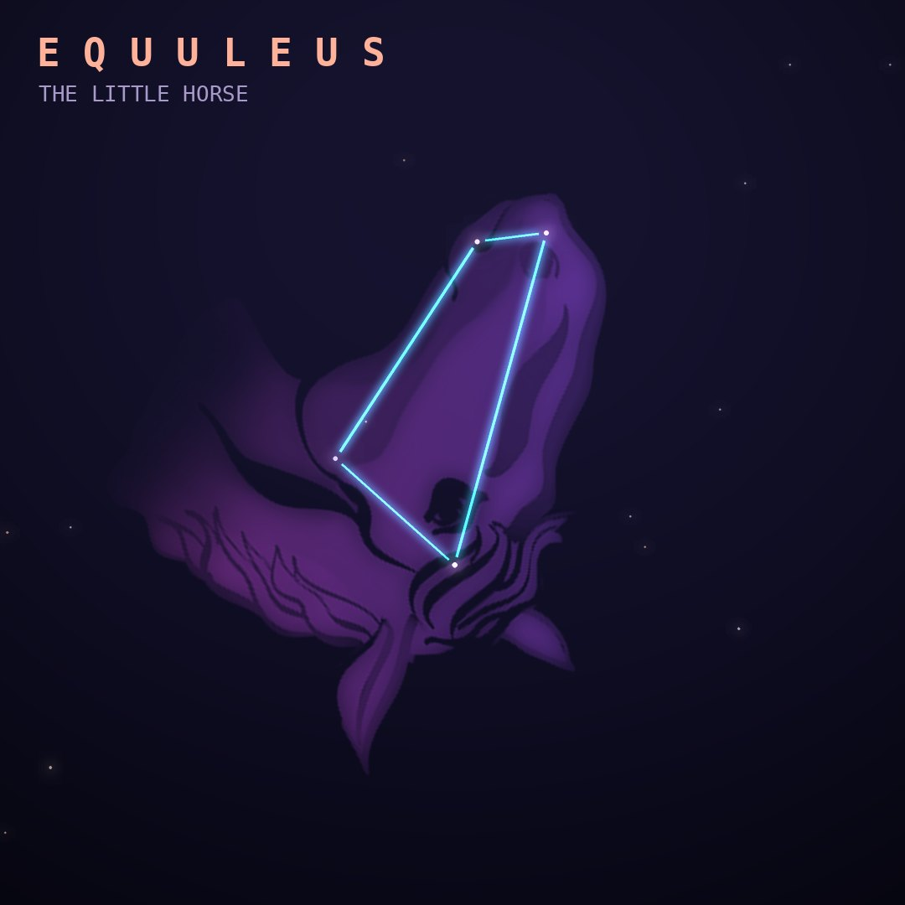

## Front

Which constellation is this?

## Back
# Equuleus
*The Little Horse* · Equ · genitive *Equulei*

A foal's head peeking out beside Pegasus, one of the 48 constellations listed by Ptolemy. It is sometimes said to be Celeris, brother of Pegasus.

- **Brightest star:** Kitalpha (α Equulei), magnitude 3.9
- **Best seen:** September evenings
- **Fully visible:** between 90°N and 80°S

> **Fun fact:** Equuleus is the second-smallest constellation of all; only Crux, the Southern Cross, is smaller.
