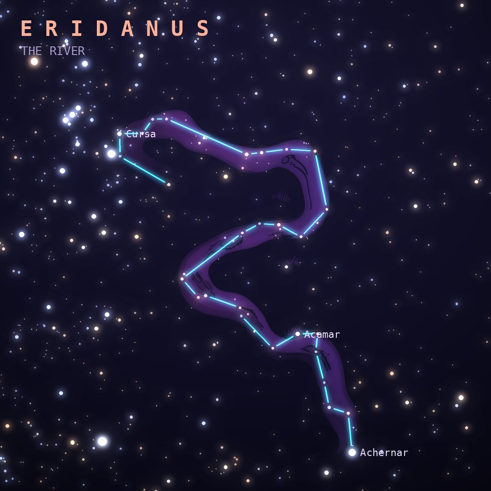

## Front

Which constellation is this?

## Back
# Eridanus
*The River* · Eri · genitive *Eridani*

A celestial river meandering from Orion's foot far into the southern sky, often linked to the river where Phaethon fell after losing control of the Sun's chariot. It is the sixth-largest constellation.

- **Brightest star:** Achernar (α Eridani), magnitude 0.5
- **Best seen:** December evenings
- **Fully visible:** between 35°N and 90°S

> **Fun fact:** Achernar, at the river's end, spins so fast that it is one of the least spherical stars known, about 35% wider at the equator than pole to pole.
