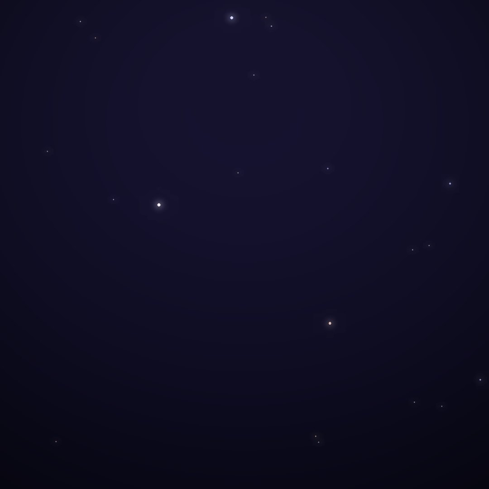
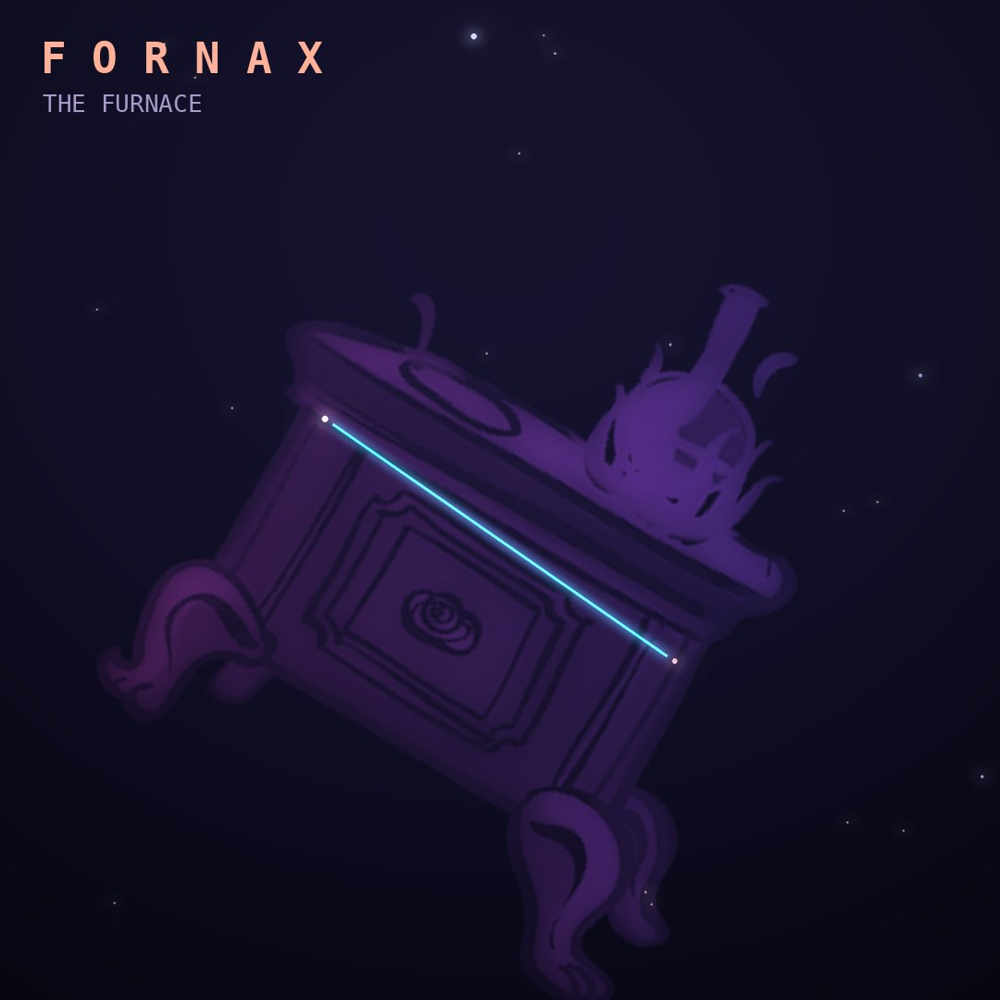

## Front

Which constellation is this?

## Back
# Fornax
*The Furnace* · For · genitive *Fornacis*

One of Lacaille's 1750s inventions, originally Fornax Chemica, the chemical furnace used in laboratory experiments. It is a faint patch inside a loop of Eridanus.

- **Brightest star:** Dalim (α Fornacis), magnitude 3.8
- **Best seen:** December evenings
- **Fully visible:** between 50°N and 90°S

> **Fun fact:** The Hubble Ultra Deep Field was taken in Fornax. A patch of sky smaller than a grain of sand held at arm's length turned out to contain about 10,000 galaxies.
