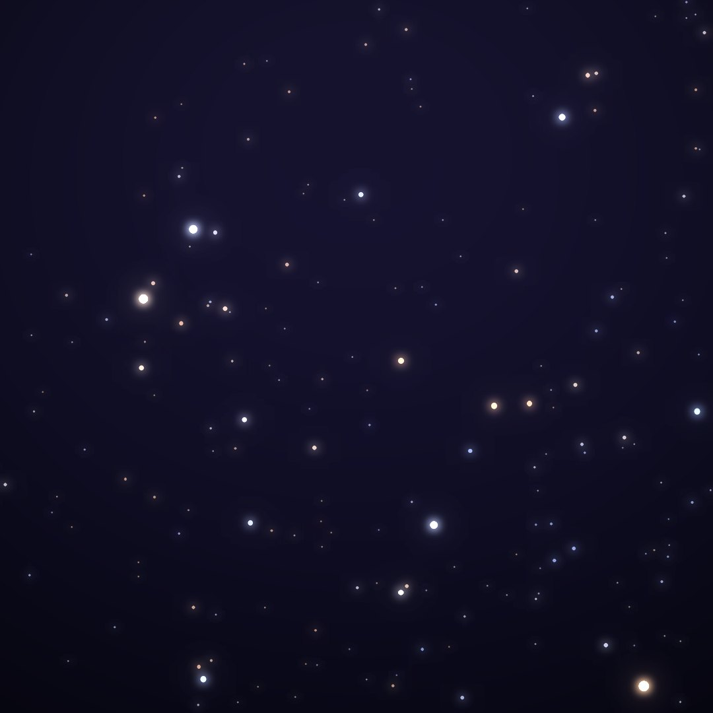
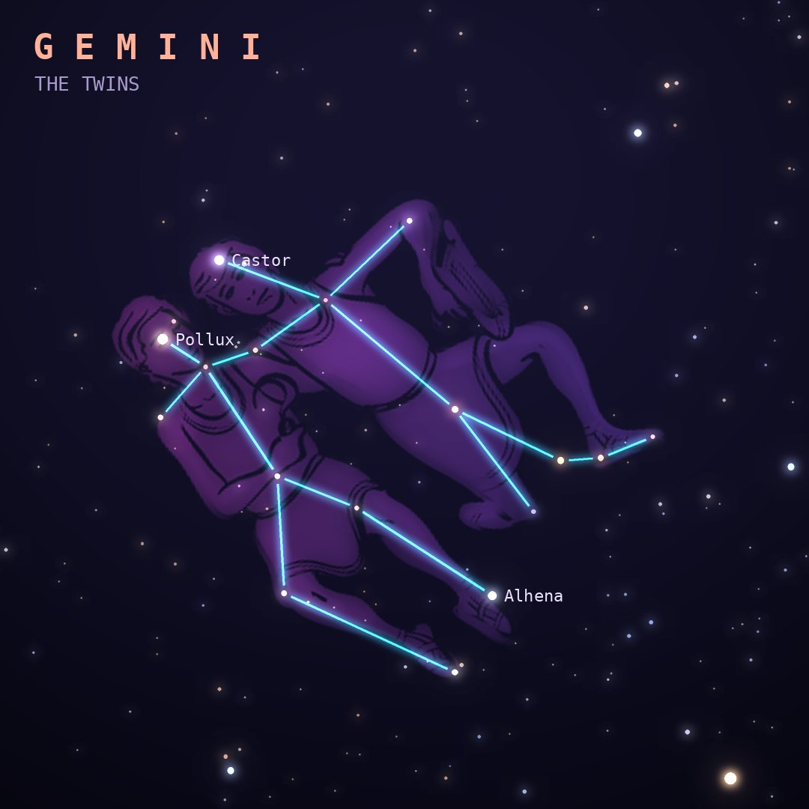

## Front

Which constellation is this?

## Back
# Gemini
*The Twins* · Gem · genitive *Geminorum*

The twins Castor and Pollux, sons of Leda. When mortal Castor died, immortal Pollux shared his immortality so they could stay together. Their two bright stars mark the twins' heads.

- **Brightest star:** Pollux (β Geminorum), magnitude 1.2
- **Best seen:** February evenings
- **Fully visible:** between 90°N and 55°S

> **Fun fact:** Castor looks like one star but is a system of six: three pairs of stars orbiting each other. The December Geminid meteor shower comes from an asteroid, 3200 Phaethon, rather than a comet.
