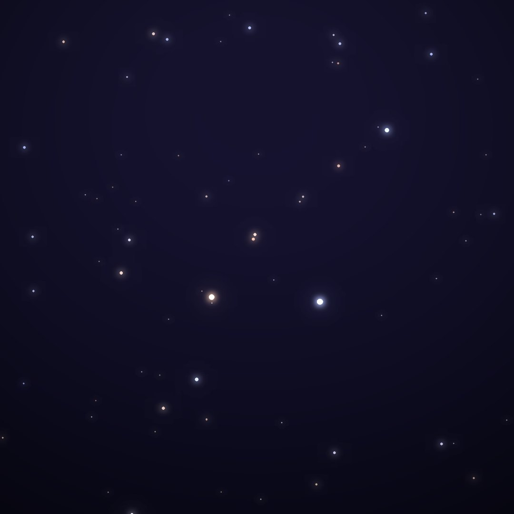
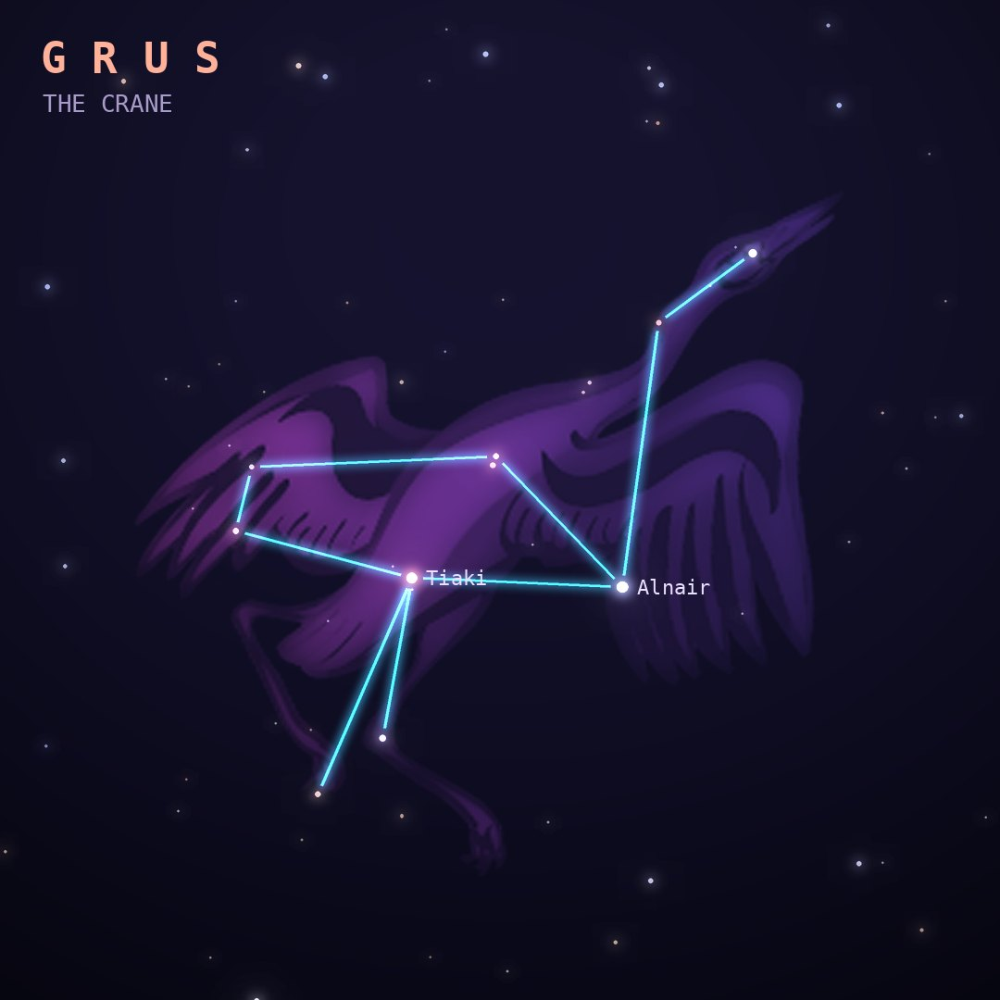

## Front

Which constellation is this?

## Back
# Grus
*The Crane* · Gru · genitive *Gruis*

A long-necked crane, introduced from the observations of Dutch navigators Keyser and de Houtman in the 1590s. It stands just south of Piscis Austrinus.

- **Brightest star:** Alnair (α Gruis), magnitude 1.7
- **Best seen:** October evenings
- **Fully visible:** between 35°N and 90°S

> **Fun fact:** Its two brightest stars make a lovely color contrast even to the naked eye: Alnair is blue-white, while Beta Gruis is a cool red giant.
