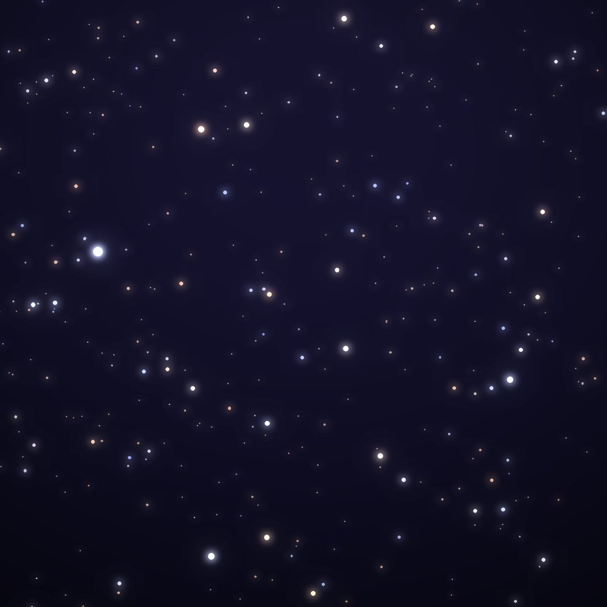
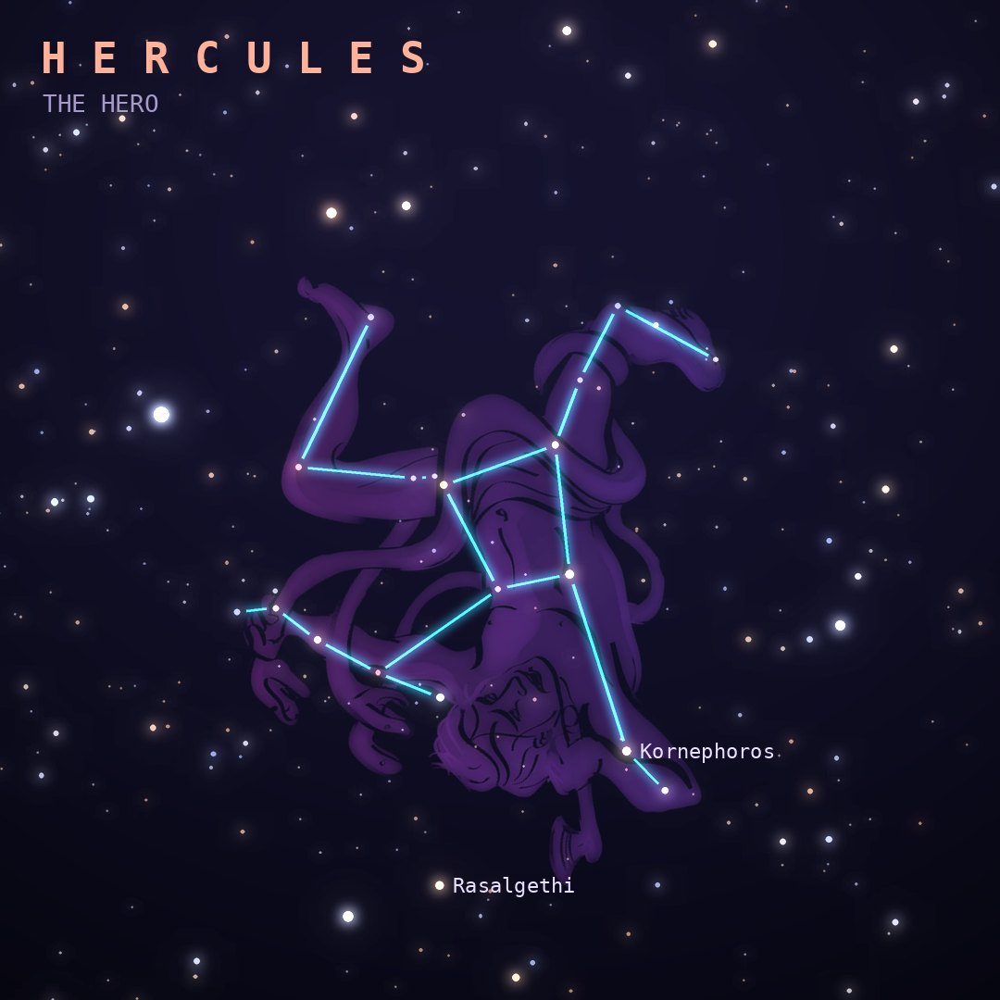

## Front

Which constellation is this?

## Back
# Hercules
*The Hero* · Her · genitive *Herculis*

The Greek hero Heracles, drawn kneeling upside down with one foot on Draco's head. Four of its stars form the "Keystone". It is the fifth-largest constellation.

- **Brightest star:** Kornephoros (β Herculis), magnitude 2.8
- **Best seen:** July evenings
- **Fully visible:** between 90°N and 40°S

> **Fun fact:** In 1974 the Arecibo radio telescope beamed a message toward the Great Globular Cluster M13 in Hercules. It will arrive in about 25,000 years.
