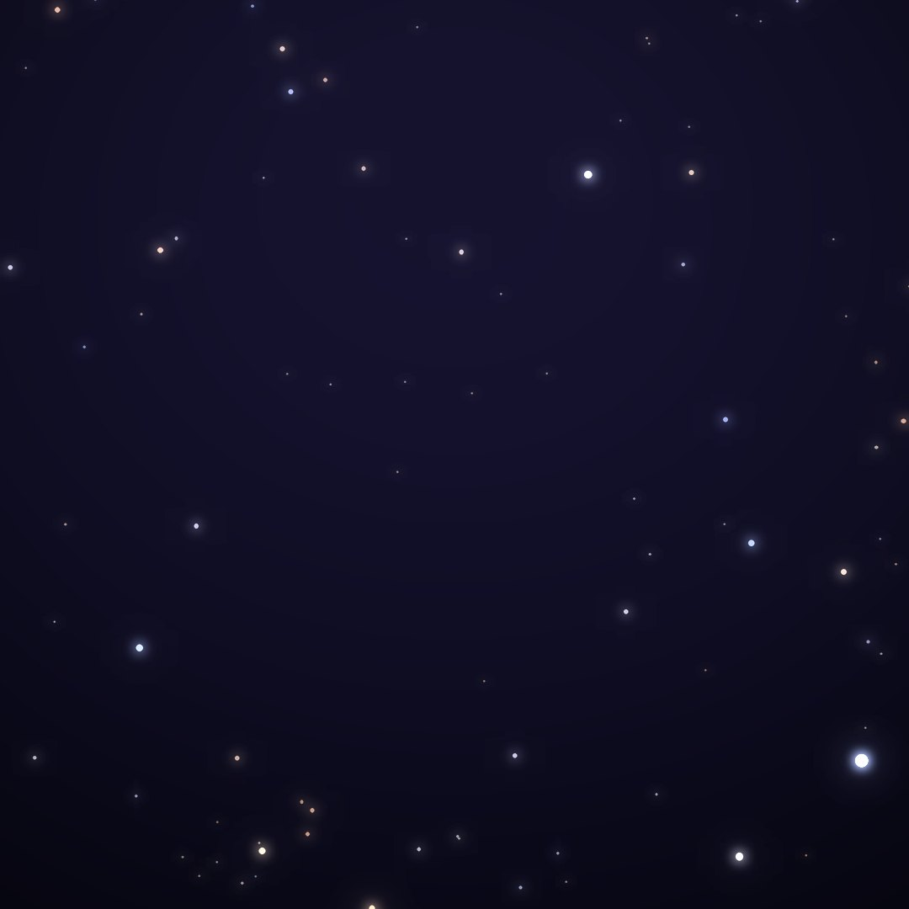
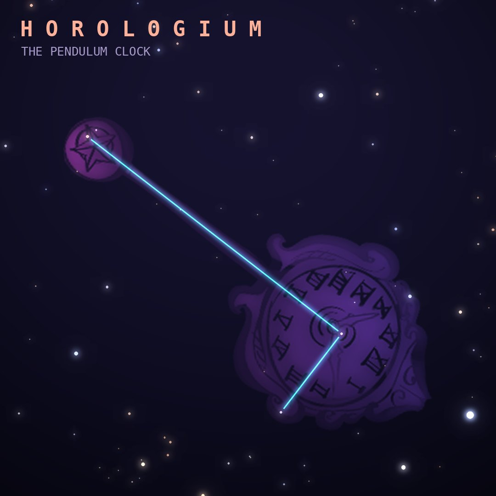

## Front

Which constellation is this?

## Back
# Horologium
*The Pendulum Clock* · Hor · genitive *Horologii*

One of Lacaille's 1750s inventions, honoring the pendulum clock that made precise astronomical timing possible. It is a faint line of stars near Eridanus.

- **Brightest star:** α Horologii, magnitude 3.9
- **Best seen:** December evenings
- **Fully visible:** between 25°N and 90°S

> **Fun fact:** Far beyond its faint stars lies the Horologium-Reticulum Supercluster, one of the largest known structures in the nearby universe.
