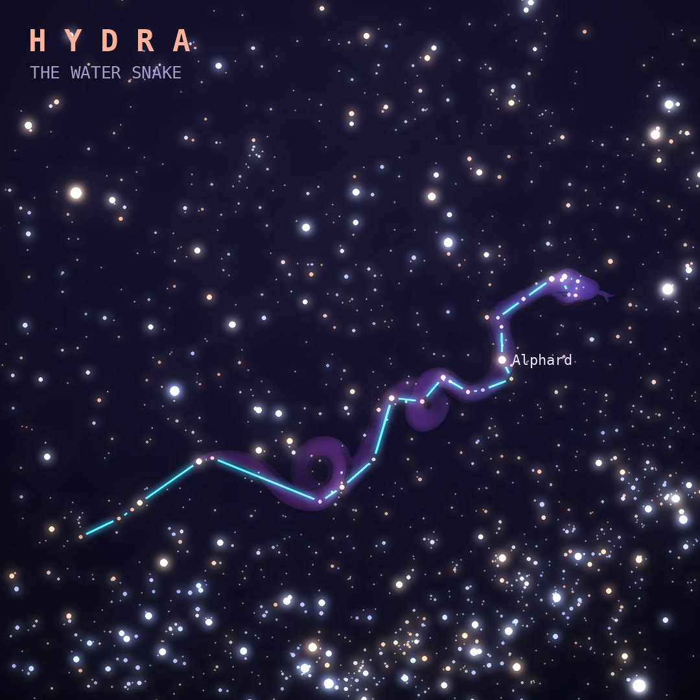

## Front

Which constellation is this?

## Back
# Hydra
*The Water Snake* · Hya · genitive *Hydrae*

The largest of the 88 constellations, a sea serpent sprawling more than 100° across the sky, with Corvus and Crater riding on its back. It is often linked to the many-headed Hydra slain by Heracles.

- **Brightest star:** Alphard (α Hydrae), magnitude 2.0
- **Best seen:** April evenings
- **Fully visible:** between 55°N and 85°S

> **Fun fact:** Its brightest star, Alphard, means "the solitary one" in Arabic, because it shines alone in an otherwise empty stretch of sky.
