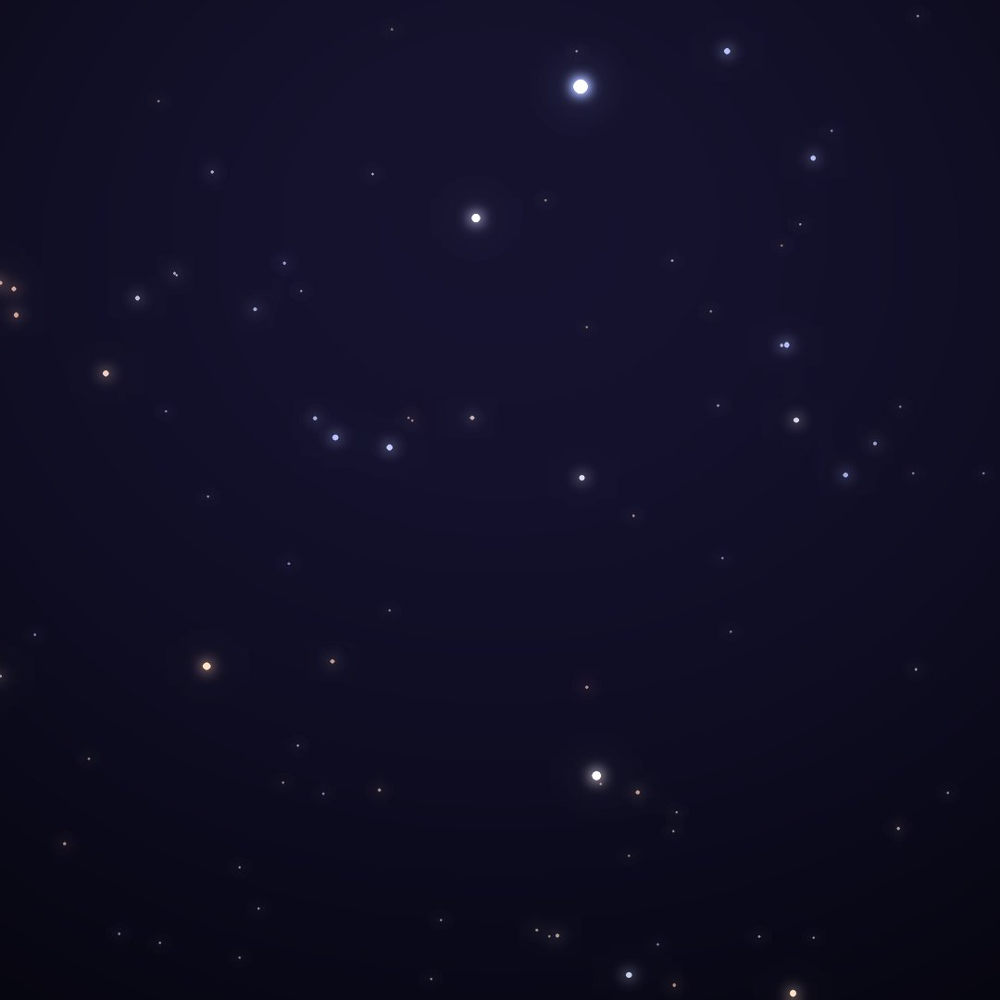
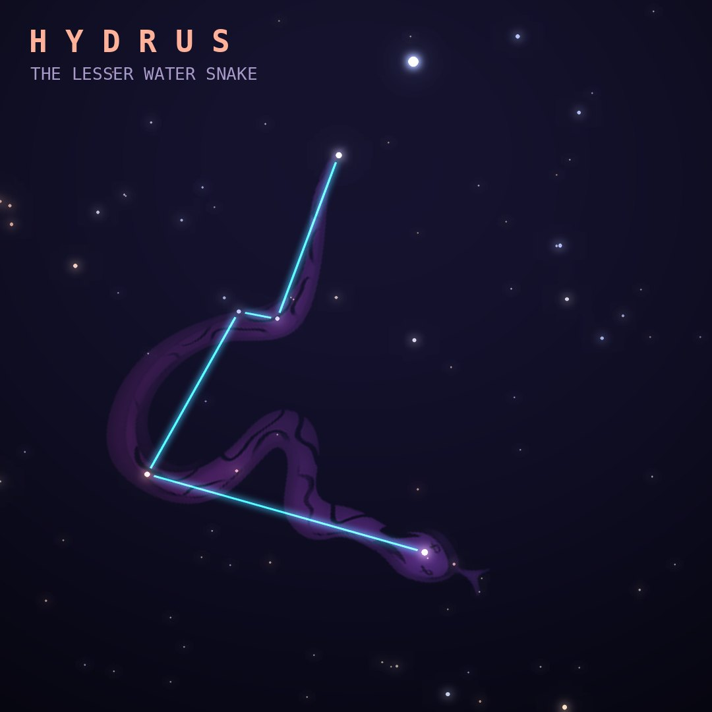

## Front

Which constellation is this?

## Back
# Hydrus
*The Lesser Water Snake* · Hyi · genitive *Hydri*

A small water snake near the south celestial pole, introduced by Keyser and de Houtman in the 1590s. It winds between the Large and Small Magellanic Clouds.

- **Brightest star:** β Hydri, magnitude 2.8
- **Best seen:** December evenings
- **Fully visible:** between 10°N and 90°S

> **Fun fact:** Beta Hydri, only 24 light-years away, is a preview of the Sun's future: a slightly older Sun-like star that is starting to swell into a subgiant.
