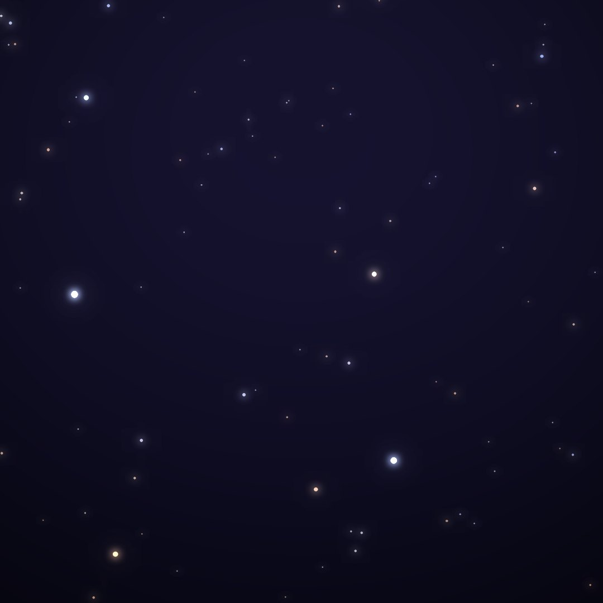
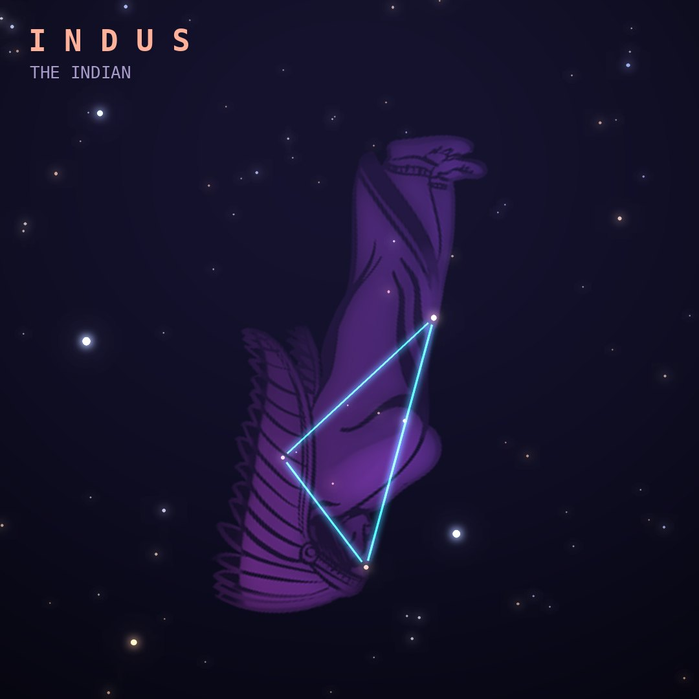

## Front

Which constellation is this?

## Back
# Indus
*The Indian* · Ind · genitive *Indi*

Introduced by Keyser and de Houtman in the 1590s, depicting an Indigenous person of the lands Dutch traders visited, armed with arrows and a spear.

- **Brightest star:** Persian (α Indi), magnitude 3.1
- **Best seen:** September evenings
- **Fully visible:** between 20°N and 90°S

> **Fun fact:** Epsilon Indi, just 12 light-years away, has two brown dwarfs and a cold giant planet; JWST photographed the planet directly in 2024.
