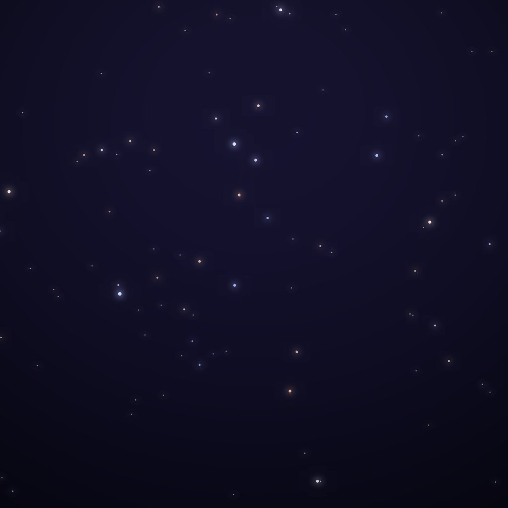
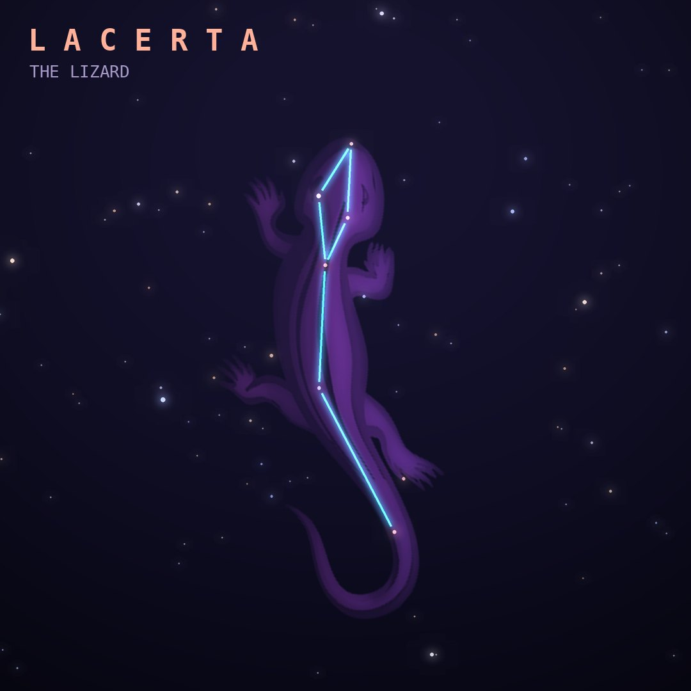

## Front

Which constellation is this?

## Back
# Lacerta
*The Lizard* · Lac · genitive *Lacertae*

A small zigzag of faint stars wedged between Cygnus and Andromeda, created by Johannes Hevelius in 1687.

- **Brightest star:** α Lacertae, magnitude 3.8
- **Best seen:** October evenings
- **Fully visible:** between 90°N and 40°S

> **Fun fact:** BL Lacertae was catalogued as a variable star but turned out to be the blazing core of a distant galaxy, which gave its name to a whole class of objects called BL Lac objects.
