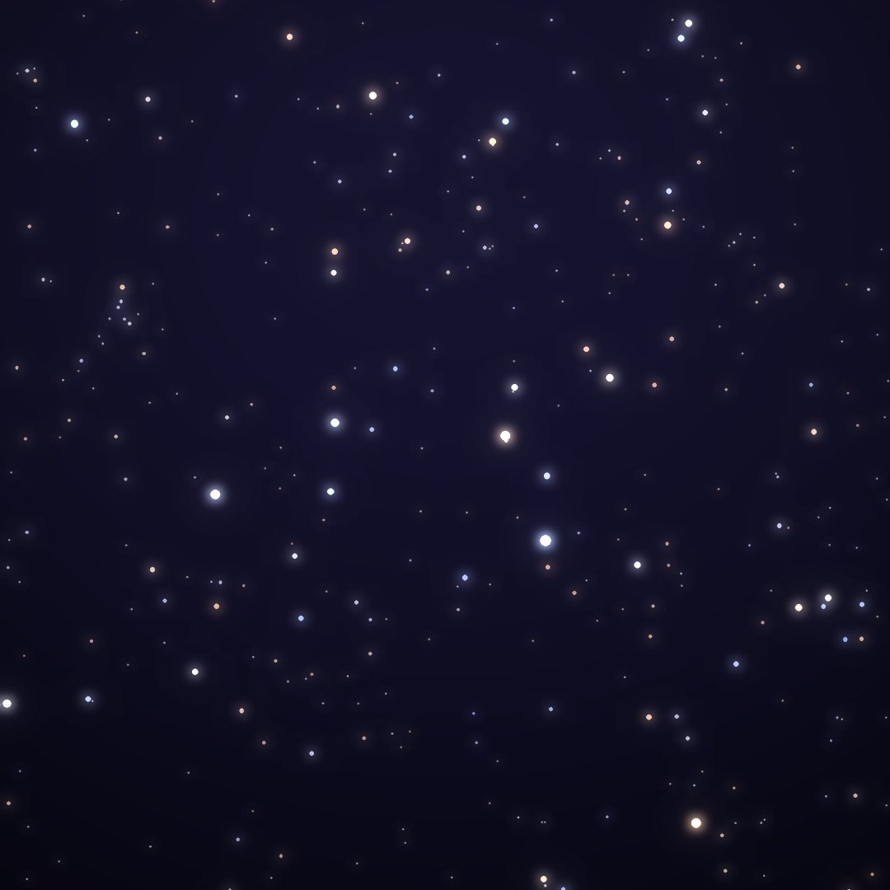
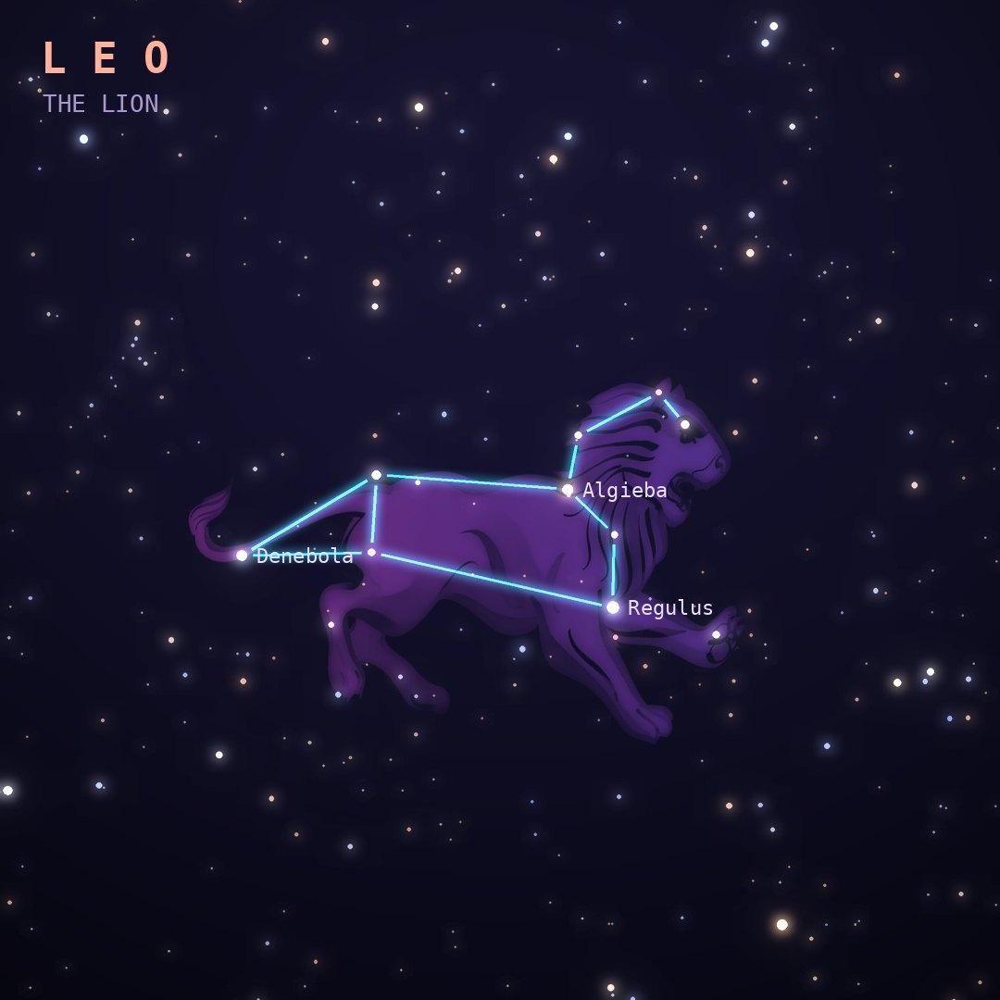

## Front

Which constellation is this?

## Back
# Leo
*The Lion* · Leo · genitive *Leonis*

The Nemean lion slain by Heracles as his first labor. A backward question mark of stars, the Sickle, outlines its head and mane, with Regulus at the lion's heart.

- **Brightest star:** Regulus (α Leonis), magnitude 1.4
- **Best seen:** April evenings
- **Fully visible:** between 85°N and 60°S

> **Fun fact:** The Leonid meteors radiate from Leo every November; in 1833 they produced a storm of tens of thousands of meteors per hour that kick-started the study of meteor showers.
