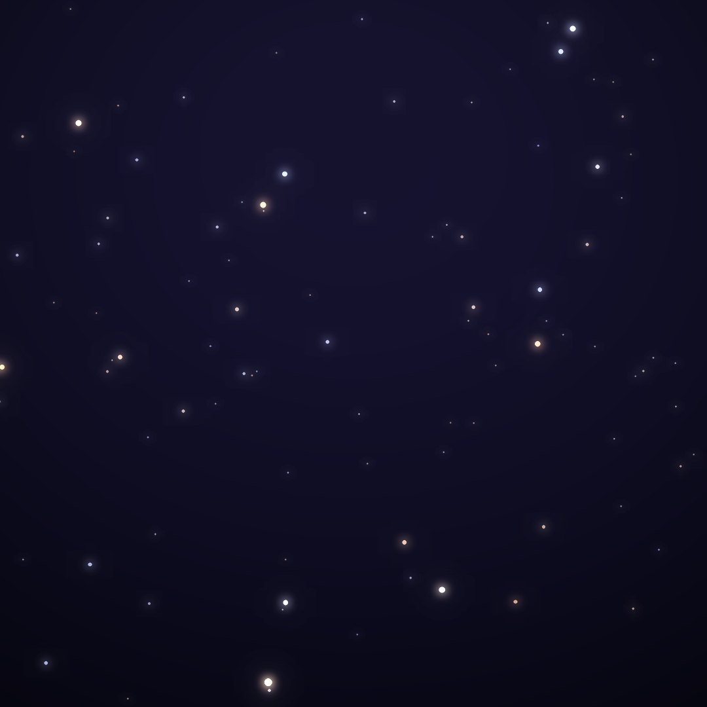
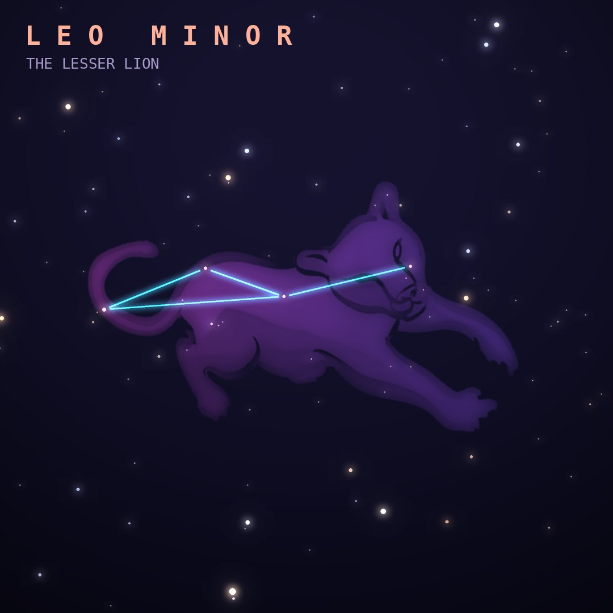

## Front

Which constellation is this?

## Back
# Leo Minor
*The Lesser Lion* · LMi · genitive *Leonis Minoris*

A faint little lion cub tucked between Leo and Ursa Major, created by Johannes Hevelius in 1687.

- **Brightest star:** Praecipua (46 Leonis Minoris), magnitude 3.8
- **Best seen:** April evenings
- **Fully visible:** between 90°N and 45°S

> **Fun fact:** Leo Minor has a Beta star but no Alpha: when Francis Baily assigned Greek letters in 1845 he gave out Beta and skipped Alpha entirely.
