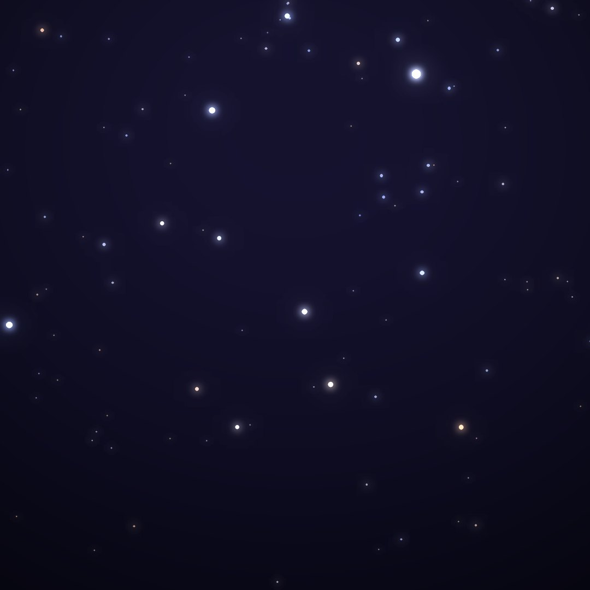
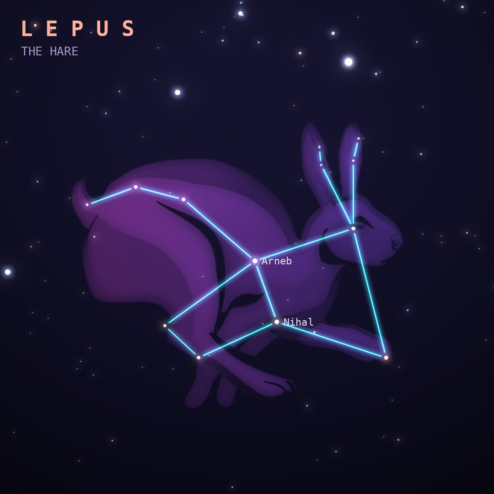

## Front

Which constellation is this?

## Back
# Lepus
*The Hare* · Lep · genitive *Leporis*

A hare crouching at Orion's feet, forever chased by the hunter and his dogs. It is one of Ptolemy's 48 constellations.

- **Brightest star:** Arneb (α Leporis), magnitude 2.6
- **Best seen:** January evenings
- **Fully visible:** between 65°N and 90°S

> **Fun fact:** Hind's Crimson Star (R Leporis) is one of the reddest stars in the sky; its discoverer described it as looking "like a drop of blood on a black field".
