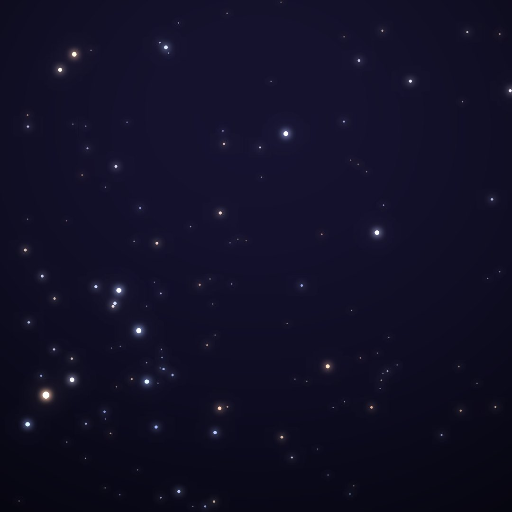
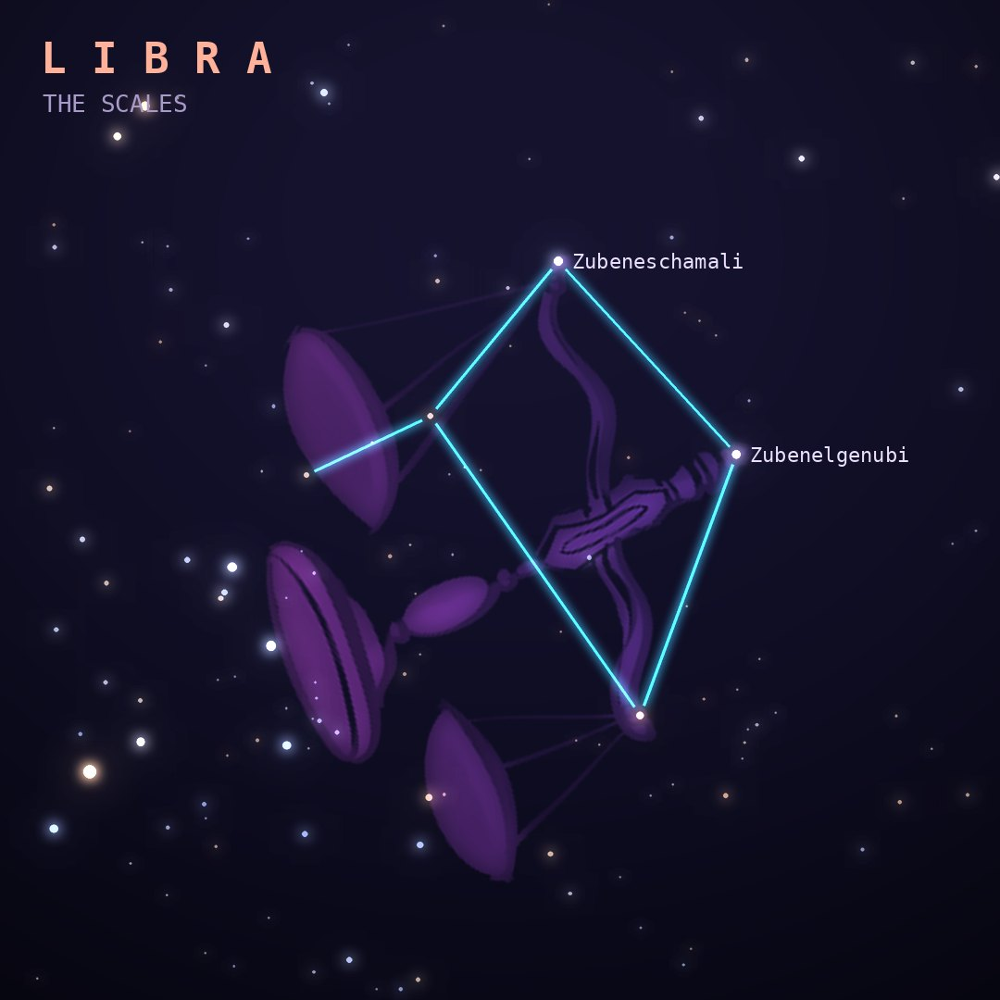

## Front

Which constellation is this?

## Back
# Libra
*The Scales* · Lib · genitive *Librae*

The scales of justice, the only zodiac sign that is an object rather than a creature. In earlier times its stars formed the claws of Scorpius.

- **Brightest star:** Zubeneschamali (β Librae), magnitude 2.6
- **Best seen:** June evenings
- **Fully visible:** between 60°N and 90°S

> **Fun fact:** Its two brightest stars are Zubenelgenubi and Zubeneschamali, Arabic for "the southern claw" and "the northern claw", left over from when Libra was part of the scorpion.
