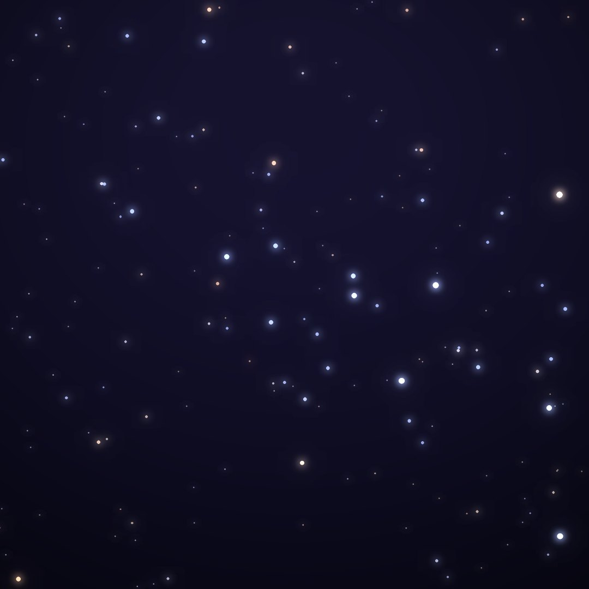
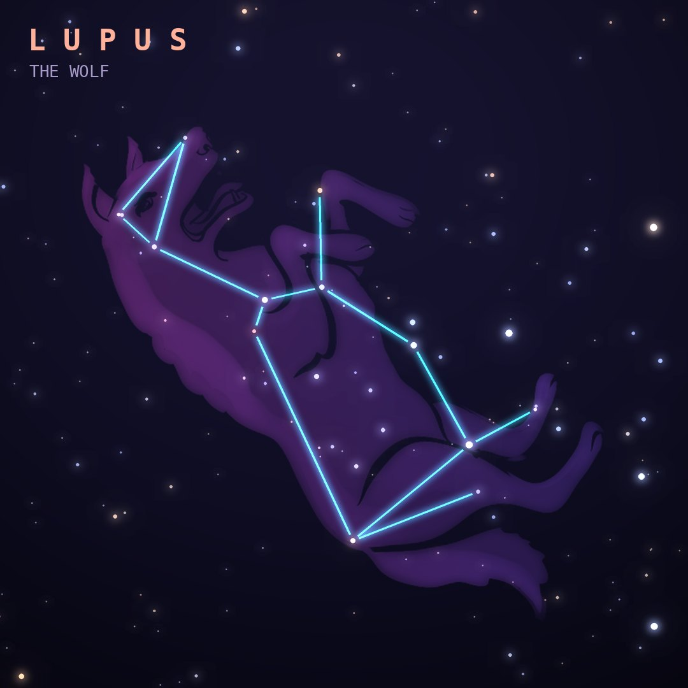

## Front

Which constellation is this?

## Back
# Lupus
*The Wolf* · Lup · genitive *Lupi*

An ancient constellation showing a wild animal, later called a wolf, held on a spear by the Centaur next door.

- **Brightest star:** α Lupi, magnitude 2.3
- **Best seen:** June evenings
- **Fully visible:** between 35°N and 90°S

> **Fun fact:** SN 1006, the brightest supernova in recorded history, blazed in Lupus in the year 1006. It was bright enough to read by at night and was recorded in China, Egypt, Iraq, Japan and Europe.
