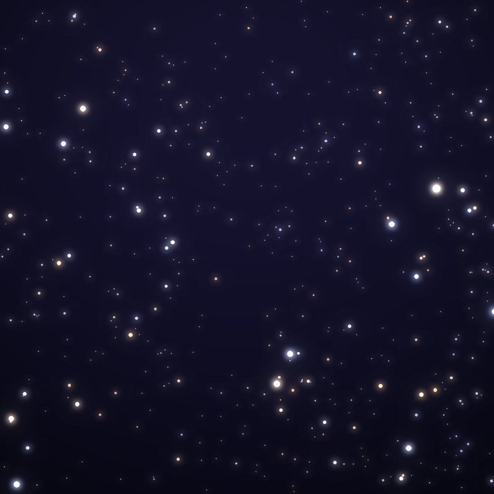
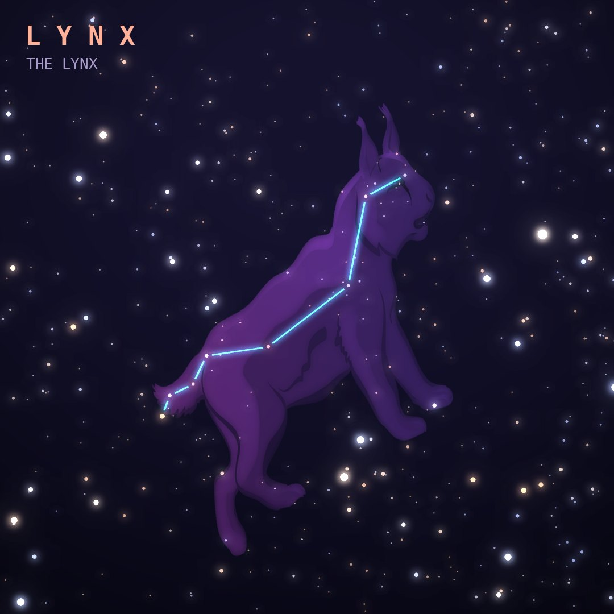

## Front

Which constellation is this?

## Back
# Lynx
*The Lynx* · Lyn · genitive *Lyncis*

A long, faint chain of stars between Ursa Major and Auriga, created by Johannes Hevelius in 1687.

- **Brightest star:** α Lyncis, magnitude 3.1
- **Best seen:** March evenings
- **Fully visible:** between 90°N and 30°S

> **Fun fact:** Hevelius named it Lynx because, he said, you'd need the eyes of a lynx to see it at all.
