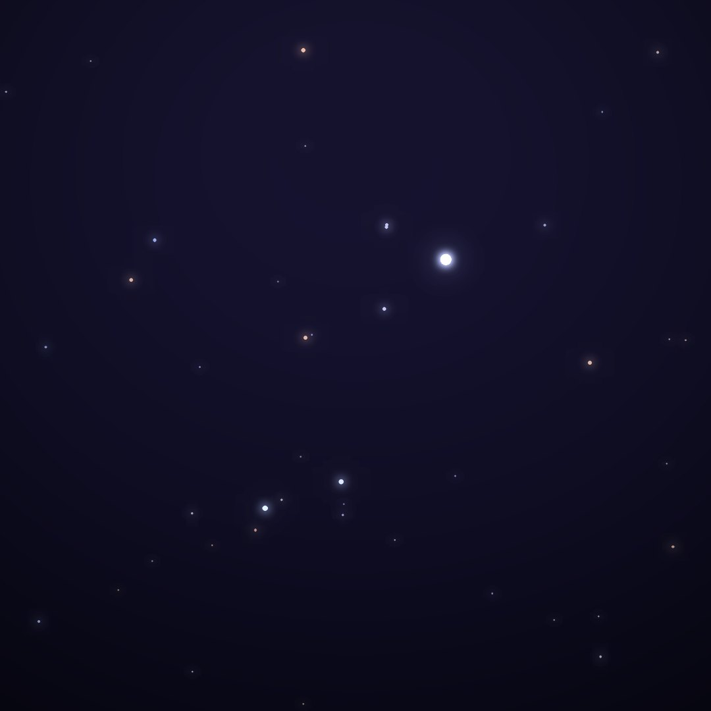
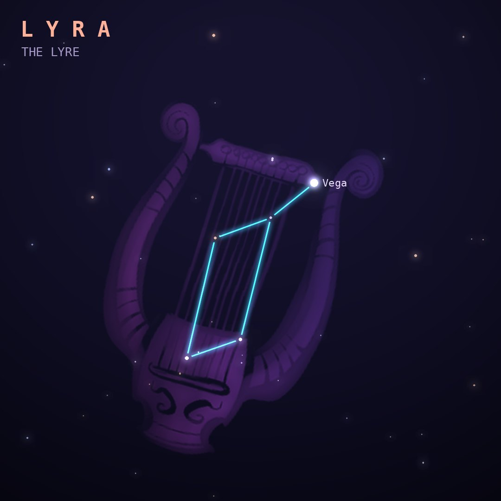

## Front

Which constellation is this?

## Back
# Lyra
*The Lyre* · Lyr · genitive *Lyrae*

The lyre of Orpheus, whose music could charm rocks and rivers. Its brilliant star Vega is one corner of the Summer Triangle.

- **Brightest star:** Vega (α Lyrae), magnitude 0.0
- **Best seen:** August evenings
- **Fully visible:** between 90°N and 45°S

> **Fun fact:** Vega was the first star after the Sun to be photographed, in 1850. Thanks to Earth's wobble it was the North Star around 12,000 BC and will be again around AD 13,700.
