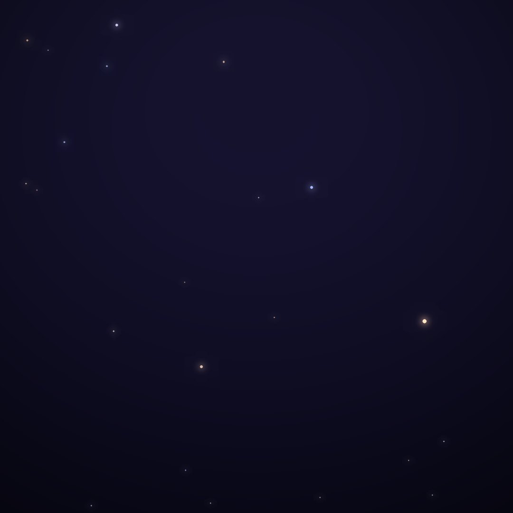
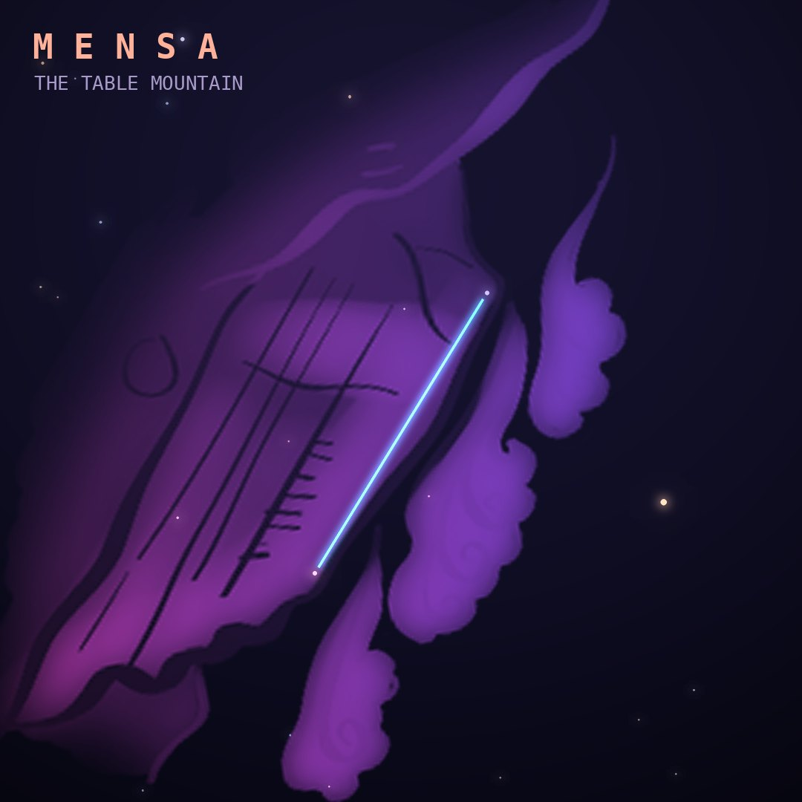

## Front

Which constellation is this?

## Back
# Mensa
*The Table Mountain* · Men · genitive *Mensae*

Lacaille named it for Table Mountain above Cape Town, where he observed the southern sky in the 1750s. Part of the Large Magellanic Cloud spills into it, like the cloud that often caps the real mountain.

- **Brightest star:** α Mensae, magnitude 5.1
- **Best seen:** January evenings
- **Fully visible:** between 10°N and 90°S

> **Fun fact:** Mensa is the faintest of all 88 constellations, with its brightest star only magnitude 5.1, and the only one named after a place on Earth.
